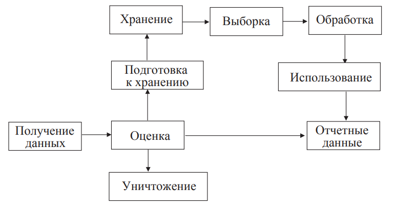
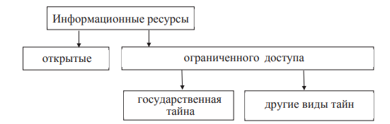

# Раздел 1. Основные понятия теории информационной безопасности

## 1.1 История становления теории информационной безопасности

При рассмотрении вопросов информационной безопасности в настоящее время можно выделить два подхода:
* **Неформальный**, или описательный. При этом комплекс вопросов построения защищённых систем делится на основные направления, соответствующие угрозам, разрабатывается комплекс мер и механизмов защиты по каждому направлению.
* **Формальный**. Основан на понятии политики безопасности и определении способов гарантирования выполнения её положений.

К числу перспективных направлений следует отнести следующие:
* Формализация положений теории информационной безопасности;
* Разработка моделей безопасности, более точно отражающих существующий уровень развития компьютерной техники и информационных технологий и более удобных для практического использования и анализа защищенности реальных АС;
* Разработка средств и методов противодействия угрозам
информационной войны;
* Вопросы обеспечения безопасности в глобальных информационных сетях, например Internet;
* Безопасность систем электронной коммерции;
* Вопросы безопасности обработки информации мобильными пользователями.

Центры информационной безопасности:
* **Информационно-аналитические**. В основном занимаются сбором и распространением информации об известных уязвимых местах систем, атаках и вторжениях, программных и аппаратных средствах профилактики и защиты. 
* **Оперативного реагирования**. Для этих центров ключевым аспектом деятельности является оказание практической помощи тем, чьим интересам был нанесен ущерб в результате нарущения информационной безопасности.
* **Консультационные**. Преимущественно занимаются оказанием консалтинговых услуг организациям, испытывающим трудности с выбором или внедрением программных, аппаратных или комплексных мер защиты, разработкой политики безопасности или использованием нормативно-правовой базы, регламентирующей вопросы применения мер защиты.
* **Научно-исследовательские**. Функционируют на базе факультетов крупных учебных заведений или подразделений государственных организаций и сосредоточены на изучении и совершенствовании теоретических основ информационной безопасности, исследовании и разработке моделей безопасных систем, совершенствовании законодательной базы.
* **Центры сертификации**. Реализуют программы тестирования, сравнения и сертификации средств защиты, а также разрабатывают подходы к сертификации и методики тестирования. Существуют государственные и независимые центры сертификации.

## 1.2 Предметная область теории ИБ
Предметной областью информационной безопасности являются:
* информация и ее свойства (конфиденциальность, доступность, целостность);
* угрозы безопасности информации и ее собственникам;
* политика безопасности и модели безопасности;
* способы, методы и средства защиты информации;
*  классификация систем защиты;
* требования к защищенности информационных систем;
* методология оценки защищенности информационных систем и проектирования защиты.
* конкретные системы защиты информации, применяемые в различных органах управления, учреждениях и на предприятиях различных форм собственности. 

## 1.3 Систематизация понятий в области ИБ

**Информационная безопасность** — состояние защищенности информационных ресурсов (информационной среды) от внутренних и внешних угроз, способных нанести ущерб интересам личности, общества, государства (национальным интересам).

**Безопасность информации** — защищенность информации от нежелательного (для соответствующих субъектов информационных отношений) ее разглашения (нарушения конфиденциальности), искажения (нарушения целостности), утраты или снижения степени доступ

*Основные правовые документы*:
* Федеральный закон «Об информации, информационных технологиях и о защите информации» от 27.07.06 № 149-ФЗ;
* Федеральный закон «О государственной тайне» от 21.09.93 № 182;
* «Гражданский кодекс Российской Федерации (часть четвертая)» от 18.12.2006 №230-ФЗ. Глава 70. Авторское право;
* Стратегия национальной безопасности Российской Федерации. Утверждена Указом Президента Российской Федерации от 31 декабря 2015 г. N 683;
* Cтpaтeгия paзвития инфopмaциoннoгo oбщecтвa в Poccийcкoй Фeдepaции нa 2017–2030 гг. Утверждена Укaзом Пpeзидeнтa Poccийcкoй Фeдepaции oт 09.05.2017 № 203.

*Основные нормативные документы*:
* ГОСТ Р 50922–96. Защита информации. Основные термины и определения.
* ГОСТ Р 50.1.053–2005 — Информационные технологии. Основные термины и определения в области технической защиты информации.
* ГОСТ Р ИСО/МЭК 15408–1–2008 — Информационная технология. Методы и средства обеспечения безопасности. Критерии оценки безопасности информационных технологий. Часть 1. Введение и общая модель.
* ГОСТ Р ИСО/МЭК 15408–2–2008 — Информационная технология. Методы и средства обеспечения безопасности. Критерии оценки безопасности информационных технологий. Часть 2. Функциональные требования безопасности.
* ГОСТ Р ИСО/МЭК 15408–3–2008 — Информационная технология. Методы и средства обеспечения безопасности. Критерии оценки безопасности информационных технологий. Часть 3. Требования доверия к безопасности.
* ГОСТ Р ИСО/МЭК 15408 — Общие критерии оценки безопасности информационных технологий.
* ГОСТ Р ИСО/МЭК 27002 — Информационные технологии. Практические правила управления информационной безопасностью.
* ГОСТ Р ИСО/МЭК 27001 — Информационные технологии. Методы безопасности. Система управления безопасностью информации. Требования.
* Руководящие документы Гостехкомиссии России.

## 1.4 Основные термины и определения правовых понятий в области информационных отношений и защиты информации

**Информация** — сведения (сообщения, данные) независимо от формы их представления.

**Информационные технологии** — процессы, методы поиска, сбора, хранения, обработки, предоставления, распространения информации и способы осуществления таких процессов и методов.

**Информационная система** — совокупность содержащейся в базах данных информации и обеспечивающих ее обработку информационных технологий и технических средств.

**Информационно-телекоммуникационная сеть** — технологическая система, предназначенная для передачи по линиям связи информации, доступ к которой осуществляется с использованием средств вычислительной техники.

**Обладатель информации** — лицо, самостоятельно создавшее информацию либо получившее на основании закона или договора право разрешать или ограничивать доступ к информации,определяемой по каким-либо признакам.

**Предоставление информации** — действия, направленные на получение информации определенным кругом лиц или передачу информации определенному кругу лиц.

**Распространение информации** — действия, направленные на получение информации неопределенным кругом лиц или передачу информации неопределенному кругу лиц.

## 1.5 Понятия предметной области защиты информации

**Защищаемая информация** — информация, являющаяся предметом собственности и подлежащая защите в соответствии с требованиями правовых документов или требованиями, устанавливаемыми собственником информации.
*Собственником* информации может быть: государство, юридическое лицо, группа физических лиц, отдельное физическое лицо.

**Защита информации** — принятие правовых, организационных и технических мер, направленных:
1) на обеспечение защиты информации от неправомерного
доступа, уничтожения, модифицирования, блокирования, копирования, предоставления, распространения, а также от иных
неправомерных действий в отношении такой информации;
2) соблюдение конфиденциальности информации ограниченного доступа;
3) реализацию права на доступ к информации.

## 1.6 Основные принципы построения систем защиты

1. Законность и обоснованность защиты.
2. Системность
3. Комплексность
4. Непрерывность защиты
5. Разумная достаточность
6. Гибкость 
7. Открытость алгоритмов и механизмов защиты
8. Простота применения

## 1.7 Концепция комплексной защиты информации 

Эффективное обеспечение защиты информации возможно только на основе комплексного использования всех известных методов и подходов к решению данной проблемы. К концепции комплексной защиты предъявляется ряд требований
1. Разработка и доведение до уровня регулярного использования всех необходимых механизмов гарантированного обеспечения требуемого уровня защищенности информации;
2. Существование механизмов практической реализации требуемого уровня защищенности;
3. Наличие средств рациональной реализации всех необходимых мероприятий по защите информации на базе достигнутого уровня развития науки и техники;
4. Разработка способов оптимальной организации и обеспечения проведения всех мероприятий по защите в процессе обработки информации.

*Функция защиты* — совокупность однородных в функциональном отношении мероприятий, регулярно осуществляемых в информационной системе различными средствами и методами в целях создания, поддержания и обеспечения условий,объективно необходимых для надежной защиты информации.

Основная задача защиты информации - определить перечень мероприятий, при которых заданный уровень защиты обеспечивается при минимальных затратах

## 1.8 Задачи защиты информации 

Классы задач:
* введение избыточности элементов системы;
* резервирование элементов системы;
* регулирование доступа к элементам системы;
* регулирование использования элементов системы;
* маскировка информации;
* контроль элементов системы;
* регистрация сведений;
* уничтожение информации;
* сигнализация;
* реагирование

## 1.9 Средства реализации комплексной защиты

Делятся на **формальные** (выполняющие защитные функции строго по заранее предусмотренной процедуре без непосредственного участия человека) и **неформальные** (определяются целенаправленной деятельностью человека либо регламентируют эту деятельность).

*Технические* средства реализуются в виде электрических, электромеханических и электронных устройств. Вся совокупность технических средств делится на:
* **Аппаратные**. Устройства, встраиваемые непосредственно в телекоммуникационную аппаратуру, или устройства, которые сопрягаются с подобной аппаратурой по стандартному интерфейсу 
* **Физические**. Реализуются в виде автономных устройств и систем.

*Программные* средства представляют собой программное обеспечение, специально предназначенное для выполнения функций защиты информации.

*Организационные* средства защиты представляют собой организационно-технические и организационно-правовые мероприятия, осуществляемые в процессе создания и эксплуатации аппаратуры телекоммуникаций для обеспечения защиты информации. 

*Законодательные* средства защиты определяются законодательными актами страны, которыми регламентируются правила использования, обработки и передачи информации ограниченного доступа и устанавливаются меры ответственности за нарушение этих правил.

*Морально-этические* средства защиты реализуются в виде всевозможных норм, которые сложились традиционно или складываются по мере распространения вычислительной техники и средств связи в данной стране или обществе. 

# Раздел 2. Информация как объект защиты

## 2.1 Понятие об информации как объекте защиты

Информация как объект познания имеет ряд особенностей:
* нематериальна по своей природе, отображается в виде символов на носителях;
* после записи на носитель информация приобретает определённые параметры и может быть измерена в объеме;
* информация, записанная на материальный носитель, может храниться, обрабатываться, передаваться по различным каналам связи;
* перемещаясь по линиям связи, информация создает физические поля, которые отражают ее содержание.

## 2.2 Уровни представления инфорамации

Выделяют:
* уровень носителей;
* уровень средств взаимодействия с носителем;
* логический уровень;
* синтаксический уровень;
* семантический уровень.

Две категории информации: 
* Признаковая - информация носителя "о себе", о видовых признаках: форма, размер, структура, химические и физические свойства, энергетические параметры
* Семантическая - то, что не зависит от вида носителя, продукт абстрактного мышления на языке символов.

Особенности вещественных носителей:
* придают информации свойство статичности (постоянства
во времени), в связи с этим обычно используются для хранения информации;
* информация фиксируется прочно, её трудно уничтожить,
не повредив носителя;
* со временем вещественные носители разрушаются и стареют, при этом информация гибнет вместе с носителем;
* запись информации связана с изменением физических
и химических свойств носителей.

**Энергетические носители** — это электромагнитное и акустическое поля.
Особенности энергетических носителей:
* используются в основном для передачи информации;
* не стареют;
* бесконтрольно распространяются в пространстве;
* способны к взаимному преобразованию;
* запись информации связана с изменением параметров поля (различные виды модуляции).

Информация записывается и передаётся при помощи символов. Символ — это некоторый знак, которому придаётся определённый смысл. Линейный набор символов образует алфавит. В процессе кодирования один алфавит может быть преобразован в другой.
В зависимости от целей различаются следующие виды кодирования:
* с целью устранения избыточности — архивирование, линейное кодирование;
* с целью устранения ошибок — помехоустойчивое кодирование;
* с целью недоступности информации — криптографическое кодирование.

## 2.3 Основные свойства защищаемой информации

**Секретность (конфиденциальность)** информации — субъективно определяемая характеристика информации, указывающая на необходимость введения ограничений на круг субъектов, имеющих доступ к данной информации. Эта характеристика обеспечивается способностью системы сохранять указанную информацию в тайне от субъектов, не имеющих полномочий на доступ к ней. Объективные предпосылки подобного ограничения доступности информации для одних субъектов заключены в необходимости защиты законных интересов других субъектов информационных отношений.

**Целостность** информации — свойство информации существовать в неискаженном виде. Обычно интересует обеспечение более широкого свойства — достоверности информации,которое складывается из адекватности (полноты и точности) отображения состояния предметной области и непосредственно целостности информации, то есть ее неискаженности. Вопросы обеспечения адекватности отображения выходят за рамки проблемы обеспечения информационной безопасности.

**Доступность** информации — свойство системы, в которой циркулирует информация, обеспечивать своевременный беспрепятственный доступ субъектов к интересующей их информации и готовность к обслуживанию поступающих от субъектов запросов всегда, когда в обращении к ним возникает необходимость.

Выше - основные св-ва. Также есть:
**Концентрация.** Суммарное количество информации может оказаться секретным, сводные данные обычно секретнее, чем одиночные.
**Рассеяние.** Ценная информация может быть разделена на части и перемешана с менее ценной с целью маскировки самого факта наличия информации. Примеры использования этого свойства — компьютерная стеганография.
**Сжатие.** Возможно сжатие без потери информации, например архивирование. Для уменьшения объема информации или увеличения пропускной способности канала передачи информации применяется сжатие с частичной потерей (например, сжатие в графических форматах типа jpg). Используется также необратимое сжатие (например, алгоритм электронно-цифровой подписи (ЭЦП), одностороннее ХЭШ-преобразование).

Прагматические свойства:
* важность;
* полнота (степень уменьшения априорной неопределенности);
* достоверность;
* своевременность;
* целесообразность;
* соотносимость с фактами, явлениями.

*Ценность информации изменяется во времени.*

**Жизненный цикл информации:**

## 2.4 Виды и формы предоставления информации. Инофрмационные ресурсы

*Информационные ресурсы* предприятия, организации, учреждения, компании и других государственных и негосударственных структур включают в себя отдельные документы и отдельные массивы документов (дела), документы и комплексы документов в информационных системах (библиотеках, архивах, фондах, банках данных электронно-информационных систем) на любых носителях, в том числе обеспечивающих работу вычислительной и организационной техники.

Любая документированная информация имеет следующие реквизиты:
* наименование документа;
* гриф секретности или конфиденциальности (если таковые имеются);
* регистрационный номер;
* дату создания и регистрации;
* автора и (или) исполнителя;
* срок действия грифа секретности или конфиденциальности, если таковые имеются;
* атрибуты учреждения

Документированная информация может быть представлена в *виде* справок, решений, приказов, распоряжений, заданий, отчетов, ведомостей, инструкций, комментариев, писем и записок, телеграмм, чеков, статей и др. Все эти виды документов могут отличаться по *форме*.

## 2.5 Структура и шкала ценности информации. Классификация информационных ресурсов
Ценность информации может быть стоимостной категорией и характеризовать конкретный размер прибыли при ее использовании или размер убытков при ее утрате. Степень ценности информации и необходимая надежность ее защиты находятся в прямой зависимости.

Выделяются два вида интеллектуально ценной информации:
* техническая, технологическая: методы изготовления продукции, программное обеспечение, производственные показатели, химические формулы, рецептуры, результаты испытаний опытных образцов, данные контроля качества и т.п.;
* деловая: стоимостные показатели, результаты исследования рынка, списки клиентов, экономические прогнозы и т.п.

Наличие права собственности на информацию как результат интеллектуальной деятельности определяет правовую целесообразность защиты информационных ресурсов.

**Классификация информационных ресурсов**

**Тайна** - нечто неизвестное, неведомое, неразгаданное, ещё не познанное, нечто скрываемое от других, известное не всем. Выделяют две глобальные предметные сферы тайны:
* тайны природы, то есть объективные тайны: тайна Вселенной, тайны рождения и смерти и множество других тайн;
* тайны людей, то есть субъективные тайны: тайны личности, тайны производства, тайны искусства и т.п.

Виды тайн:
* государственная - (ГТ) защищаемые государством сведения в области военной, внешнеполитической, экономической, разведывательной, контрразведывательной и оперативно-розыскной деятельности, распространение которых может нанести ущерб безопасности Российской Федерации. Основы защиты государственной тайны регламентируются законом РФ от 21.07.1993 N 5485–1 «О государственной тайне».
*остальные - негосударственные*
* служебная - информация ограниченного распространения, к которой относятся несекретные сведения, касающиеся деятельности организации, ограничения на распространение которых диктуются служебной необходимостью
* профессиональная -инструмент защиты персональных данных о гражданах и личной тайны граждан. Имеется в виду, что эти сведения переданы их собственником или находятся в распоряжении той или иной организации и необходимы ей для выполнения профессиональной деятельности: врачебная тайна, тайна страхования, тайна завещания, тайна голосования, тайна предприятий связи, тайна налоговых органов и др. Профессиональная тайна может быть также тайной мастерства, тайной профессионального умения, например тайна
творчества, тайна рационализатора и др.
* коммерческая - сведения, имеющие действительную или потенциальную коммерческую ценность в силу неизвестности их третьим лицам, когда к ним нет свободного доступа на законном основании и обладатель этих сведений принимает меры к охране их конфиденциальности.
* личная

Перечень сведений конфиденциального характера утвержден Указом Президента РФ от 06.03.1997 г. № 188.

К документам ограниченного доступа относятся:
* в государственных структурах: документы, проекты документов и сопутствующие материалы, относимые к служебной инфомации ограниченного распространения (документы «для служебного пользования»), содержащие сведения, отнесенные к служебной тайне, имеющие рабочий характер и не подлежащие опубликованию в открытой печати;
* в предпринимательских структурах — документы, содержащие сведения, которые собственник или владелец в соответствии с законодательством имеет право отнести к коммерческой (предпринимательской) тайне, тайне мастерства;
* независимо от принадлежности — документы и базы данных, фиксирующие любые персональные (личные) данные о гражданах, а также содержащие профессиональную тайну, технические и технологические новшества (до их патентования), тайну предприятий связи, сферы обслуживания и т.п.

## 2.6 Правовой режим информационных ресурсов

Правовой режим информационных ресурсов определяется
нормами, устанавливающими:
* порядок документирования информации;
* право собственности на отдельные документы и их массивы;
* категорию информации по уровню доступа к ней;
* порядок правовой защиты информации.

Государственные информационные ресурсы РФ являются открытыми и общедоступными, исключение составляет документированная информация, отнесенная законом к категориям ограниченного доступа.

Закон РФ «О государственной тайне» от 21.09.93 № 182-ФЗ

Собственник информационных ресурсов имеет право осуществлять контроль за выполнением требований по защите информации и запрещать или приостанавливать обработку информации в случае невыполнения этих требований.

# Раздел 3. Государственная политика информационной безопасности. Концепция комплексного обеспечения информационной безопасности

## 3.1 Информационная безопасность и её место в системе национальной безопасности Российской Федерации

Под национальной безопасностью понимается **состояние защищенности** жизненно важных национальных интересов от внутренних и внешних угроз, при котором обеспечивается реализация конституционных прав и свобод граждан Российской Федерации, достойные качество и уровень их жизни, суверенитет, независимость, государственная и территориальная целостность, устойчивое социально-экономическое развитие Российской Федерации. 

Информационная безопасность Российской Федерации — состояние защищенности личности, общества и государства от внутренних и внешних информационных угроз, при котором обеспечиваются реализация конституционных прав и свобод человека и гражданина, достойные качество и уровень жизни граждан, суверенитет, территориальная целостность и устойчивое социально-экономическое развитие Российской Федерации, оборона и безопасность государства.

«Стратегия национальной безопасности Российской Федерации» утверждена Указом Президента Российской Федерации 31.12.2015 № 683 — официально признанная система стратегических приоритетов, целей и мер в области внутренней и внешней политики, определяющих состояние национальной безопасности и уровень устойчивого развития государства на долгосрочную перспективу.

"Доктрина информационной безопасности Российской Федерации", введенная в действие
Указом Президента РФ от 05.12.2016 N 646, представляет собой систему официальных взглядов на обеспечение национальной безопасности Российской Федерации в информационной сфере. В Доктрине определены национальные интересы в информационной сфере, введены основные информационные угрозы и состояние информационной безопасности, сформулированы стратегические цели и основные направления обеспечения информационной безопасности, описаны организационные основы обеспечения информационной безопасности.

Законодательную основу обеспечения безопасности составляют:
Конституция РФ;
* законы и другие нормативные акты РФ, регулирующие
отношения в области безопасности;
* конституции, законы, нормативные акты республик;
* нормативные акты органов власти и управления краев,
областей, принятые в пределах их компетенции;
* международные договоры и соглашения, заключенные
или признанные РФ;
* основные законы в области защиты информации, прав
субъектов, участвующих в информационных процессах
и информатизации;
* федеральный закон «О безопасности» № 390-ФЗ
от 28.12.2010;
* федеральный закон от 27.07.2006 N 149-ФЗ «Об информации, информационных технологиях и о защите информации»;
* федеральный закон от 21.09.93 г. № 182 «О государственной тайне»;
* федеральный закон от 27.07.06 г. №152-ФЗ «О персональных данных»;
федеральный закон от 27.12.91 г. «О средствах массовой
информации»;
* федеральный закон от 6.04.11 г. № 63-ФЗ «Об электронной подписи»;
* Гражданский кодекс РФ (ч. 1, 2. 4);
* Уголовный кодекс РФ

Развитие законодательной базы в области информационной безопасности идет по четырем основным направлениям:
* защита сведений, составляющих государственную тайну;
* защита конфиденциальной информации;
* защита авторского права в сфере информатизации;
* защита права на доступ к информации.

Систему национальной безопасности Российской Федерации образуют:
* органы законодательной, исполнительной и судебной властей;
* государственные, общественные и иные организации и объединения;
* граждане, принимающие участие в обеспечении безопасности в соответствии с законом;
* законодательство, регламентирующее отношения в сфере безопасности.

Силы обеспечения безопасности включают в себя:
* Вооруженные силы (ВС РФ);
* федеральные органы безопасности (ФСБ РФ);
* органы внутренних дел (МВД РФ);
* органы внешней разведки (СВР РФ);
* органы обеспечения безопасности органов законодательной, исполнительной, судебной властей и их высших должностных лиц;
* налоговую службу;
* службы ликвидации последствий чрезвычайных ситуаций (МЧС РФ);
* формирования гражданской обороны;
* пограничные войска;
* внутренние войска;
* органы, обеспечивающие безопасное ведение работ в промышленности, энергетике, на транспорте и в сельском хозяйстве;
* таможни, природоохранительные органы, органы охраны здоровья населения и другие

# Раздел 4. Угрозы информационной безопасности

## 4.1 Анализ уязвимостей системы

Определение перечня угроз и построение модели нарушителя является обязательным этапом проектирования систем защиты

Анализ уязвимостей - обязательная процедура при аттестации объекта информатизации

## 4.2 Классификация угроз информационной безопасности

Угроза - фактор, стремящийся нарушить работу системы

Классификация угроз по следующим признакам:
1. Природа возникновения: естественные угрозы (связанные с природными процессами) и искусственные (вызванные деятельностью человека)
2. Степень преднамеренности проявления: случайные или преднамеренные.
3. Источник угроз: природная среда, человек, санкционированные программно-аппаратные средства, несанкционированные программно-аппаратные средства.
4. Положение источника угроз: в пределах или вне контролируемой зоны.
5. Зависимость от активности системы: проявляются только в процессе обработки данных или в любое время.
6. Степень воздействия на систему: пассивные, активные(вносят изменения в структуру и содержание системы).
7. Этап доступа к ресурсам: на этапе доступа, после получения доступа.
8. Способ доступа к ресурсам: стандартный, нестандартный.
9. Место расположения информации: внешние носители, оперативная пaмять, линии связи, устройства ввода-вывода.

Основные виды угроз:
* Нарушения конфиденциальности
* Нарушения целостности 
* Нарушения доступности
* Раскрытия параметров условий защиты

## 4.3 Основные направления и методы реализации угроз

К основным направлениям реализации злоумышленником
информационных угроз относятся:
* непосредственное обращение к объектам доступа;
* создание программных и технических средств, выполняющих обращение к объектам доступа в обход средств защиты;
* модификация средств защиты, позволяющая реализовать угрозы информационной безопасности;
* внедрение в технические средства программных или технических механизмов, нарушающих предполагаемую структуру и функции системы.

К числу основных методов реализации угроз информационной безопасности относятся:
* определение злоумышленником типа и параметров носителей информации;
* получение злоумышленником информации о программно-аппаратной среде, типе и параметрах средств вычислительной техники, типе и версии операционной системы, составе прикладного программного обеспечения;
* получение злоумышленником детальной информации
о функциях, выполняемых системой;
* получение злоумышленником данных о применяемых системах защиты;
* определение способа представления информации;
* определение злоумышленником содержания данных,
oбpaбaтываемых в системе, на качественном уровне (применяется для мониторинга и для дешифрования сообщений);
* хищение (копирование) машинных носителей информации, содержащих конфиденциальные данные;
* использование специальных технических средств для перехвата побочных электромагнитных излучений и наводок (ПЭМИН);
* уничтожение средств вычислительной техники и носителей информации;
* несанкционированный доступ пользователя к ресурсам системы в обход или путем преодоления систем защиты с использованием специальных средств, приемов, методов;
* несанкционированное превышение пользователем своих полномочий;
* несанкционированное копирование программного обеспечения;
* перехват данных, передаваемых по каналам связи;
* визуальное наблюдение;
* раскрытие представления информации (дешифрование
данных);
* раскрытие содержания информации на семантическом
уровне;
* уничтожение носителей информации;
* внесение пользователем несанкционированных изменений в программно-аппаратные компоненты системы
и обрабатываемые данные;
* установка и использование нештатного аппаратного
и/или программного обеспечения;
* заражение программными вирусами;
* внесение искажений в представление данных, уничтожение данных на уровне представления, искажение информации при передаче по линиям связи;
* внедрение дезинформации;
* выведение из строя носителей информации без уничтожения;
* проявление ошибок проектирования и разработки аппаратных и программных компонентов;
* искажение соответствия синтаксических и семантических
конструкций языка;
* запрет на использование информации.

## 4.4 Неформальная модель нарушителя

Нарушитель — это лицо, предпринявшее попытку выполнения запрещенных операций (действий) по ошибке, незнанию или осознанно со злым умыслом (из корыстных интересов) или без такового (ради игры или удовольствия, с целью самоутверждения и т.п.) и использующее для этого различные возможности, методы и средства.

Злоумышленник — нарушитель, намеренно идущий на нарушение из корыстных побуждений.

Мотивы:
* Безответственность
* Самоутверждение
* Корыстный интерес

Классификация нарушителей:
* По уровню знаний о системе:
1. знание функциональных особенностей, основных закономерностей формирования в системе массивов данных и потоков запросов к ним, умение пользоваться штатными средствами;
2. обладание высоким уровнем знаний и опытом работы
с техническими средствами системы, а также опытом их
обслуживания;
3. обладание высоким уровнем знаний в области программирования ивычислительной техники, проектирования иэксплуатации автоматизированных информационных систем;
4. знание структуры, функций и механизмов действия
средств защиты, их сильные и слабые стороны.

* По уровню возможностей:
1. запуск задач (программ) из фиксированного набора, реализующих заранее предусмотренные функции по обработке информации
2. возможность создания и запуска собственных программ с новыми функциями по обработке информации
3. возможность управления функционированием системы, т. е. воздействием на базовое программное обеспечение системы и на состав и конфигурацию ее оборудования.
4. весь объем возможностей лиц, осуществляющих проектирование, реализацию и ремонт технических средств системы, вплоть до включения в состав собственных технических средств с новыми функциями по обработке информации

* По времени действия:
    * в процессе функционирования (во время работы компонентов системы);
    * в период неактивности компонентов системы (в нерабочее время, во время плановых перерывов в ее работе, перерывов для обслуживания и ремонта и т.п.);
    * как в процессе функционирования, так и в период неактивности компонентов системы.

* По месту действия 
    * без доступа на контролируемую территорию организации;
    * с контролируемой территории без доступа в здания и сооружения;
    * внутри помещений, но без доступа к техническим средствам;
    * с рабочих мест конечных пользователей (операторов);
    * с доступом в зону данных (баз данных, архивов и т.п.);
    * с доступом в зону управления средствами обеспечения безопасности

## 4.5 Оценка уязвимости системы

При решении практических задач защиты информации большое значение имеет количественная оценка ее уязвимости.

Под прочностью защиты (преграды) понимается величина вероятности ее непреодоления нарушителем.

На контролируемых каналах нарушитель рискует быть пойманным, а на неконтролируемых - он может работать в комфортных условиях, не ограниченных временем и средствами

При расчёте прочности средств защиты учитывается временной фактор, позволяющий получить количественную оценку его прочности - ожидаемую величину вероятности непреодоления его потенциальным нарушителем.

Доктрина информационной безопасности утверждена указом Президента РФ №646 6.12.2016

## 5.4 Инженерно-технические методы защиты от НСД. Построение систем защиты от угрозы утечки по техническим каналам

Защита информации от утечки — это деятельность, направленная на предотвращение неконтролируемого распространения защищаемой информации в результате ее разглашения, несанкционированного доступа к информации и получения защищаемой информации разведками.

В соответствии с ГОСТ Р 50922–96 рассматриваются три вида утечки информации:
* разглашение;
* несанкционированный доступ к информации;
* получение защищаемой информации разведками (как отечественными, так и иностранными).

Канал утечки информации — совокупность источника информации, материального носителя или среды распространения несущего указанную информацию сигнала и средства выделения информации из сигнала или носителя.

Каналы утечки информации по физическим принципам можно разделить на следующие группы:
* акустические (включая и акустопреобразовательные).Связаны с распространением звуковых волн в воздухе или упругих колебаний в других средах;
* электромагнитные (в том числе магнитные и электрические);
* визуально-оптические (наблюдение, фотографирование). Вкачестве средства выделения информации в данном случае могут рассматриваться фото-, видеокамеры и т.п.;
* материально-вещественные (бумага, фото, магнитные носители, отходы и т.п.);
* информационные. Связаны с доступом к элементам системы, носителям информации, самой вводимой и выводимой информации, к программному обеспечению, а также с подключением к линиям связи.

## 5.5 Идентификация и аутентификация

Под безопасностью (стойкостью) системы идентификации и аутентификации будем понимать гарантированность того, что злоумышленник не способен пройти аутентификацию от имени другого пользователя.
Различают три группы методов аутентификации, основанных на наличии у пользователей:
* индивидуального объекта заданного типа; использзование пропусков, удостоверений, карт и прочих устройств
* индивидуальных биометрических характеристик; измерение и сравнение с эталоном заданных характеристик пользователя
* знаний некоторой известной только пользователю и проверяющей стороне информации. Пароли

## 5.6 Основные направления и цели использования криптографических методов

Проблемой защиты информации путем ее преобразования занимается криптология (лат. kryptos — тайный, logos — наука). Криптология разделяется на два направления — криптографию и криптоанализ. Цели этих направлений прямо противоположны.
Криптография занимается поиском и исследованием математических методов преобразования информации. Криптография дает возможность преобразовать информацию таким образом, что ее прочтение (восстановление) возможно только при знании ключа.
Сфера интересов криптоанализа — исследование возможности расшифровывания информации без знания ключей.

Алфавит — конечное множество используемых для кодирования информации знаков.
Текст — упорядоченный набор из элементов алфавита.
В качестве примеров алфавитов, используемых в современных информационных системах, можно привести следующие:
* алфавит Z33–32 буквы русского алфавита и пробел;
* алфавит Z256 — символы, входящие в стандартные коды
ASCII и КОИ-8;
* бинарный алфавит — Z2 = {0,1};
* восьмеричный алфавит или шестнадцатеричный алфавит;
Шифрование — преобразовательный процесс: исходный
текст, который носит также название открытого текста, заменяется шифрованным текстом
Дешифрование — обратный шифрованию процесс. На основе ключа шифрованный текст преобразуется в исходный.
Ключ — информация, необходимая для беспрепятственного шифрования и дешифрования текстов. Обычно ключ представляет собой последовательный ряд букв алфавита

Криптосистемы разделяются на симметричные и ассиметричные (с открытым ключом).

# Раздел 6. Построение систем защиты от угрозы нарушения целостности информации и отказа доступа

Целостность данных - отсутствие ненадлежащих изменений.

Ненадлежащие изменения: ни одному пользователю автоматизированной
системы, в том числе и авторизованному, не должны быть разрешены такие изменения данных, которые повлекут за собой их разрушение или потерю. 

Нарушение целостности информации происходит либо при несанкционированном доступе к информации, либо без него.
Угроза целостности существует на всех этапах жизни информации:
* при хранении;
* обработке;
* транспортировке.

## 6.1 Защита целостности информации при хранении
Организационно-технологические меры защиты целостности информации на электронных носителях можно разделить
на две основные группы:
* организационные меры по поддержке целостности информации;
* технологические меры контроля целостности битовых последовательностей.

Организационные меры разделяются на две группы:
* создание резервных копий информации, хранимой
на электронных носителях;
* обеспечение правильных условий хранения и эксплуатации носителей.

## 6.2 Защита целостности информации при обработке

При рассмотрении вопроса целостности данных при обработке используется интегрированный подход, основанный
на ряде работ Д. Кларка и Д. Вилсона, а также их последователей и оппонентов и включающий в себя девять теоретических
принципов:
* корректность транзакций;
* аутентификация пользователей;
* минимизация привилегий;
* разграничение функциональных обязанностей;
* аудит произошедших событий;
* объективный контроль;
* управление передачей привилегий;
* обеспечение непрерывной работоспособности;
* простота использования защитных механизмов.

## 6.3 Защита целостности при транспортировке

Средства контроля целостности должны обеспечивать защиту от несанкционированного изменения информации нарушителем при ее передаче по каналам связи.

Схема контроля целостности данных подразумевает выполнение двумя сторонами — источником и приемником — некоторых (возможно, разных) криптографических преобразований данных. Источник преобразует исходные данные и передает их приемнику вместе с некоторым приложением, обеспечивающим избыточность шифрограммы.

Приемник обрабатывает полученное сообщение, отделяет
приложение от основного текста и проверяет их взаимное соответствие, осуществляя таким образом контроль целостности. 

Контроль целостности может выполняться с восстановлением
или без восстановления исходных данных.
Целостность отдельного сообщения обеспечивается имитовставкой, ЭЦП или шифрованием, целостность потока

Термин **«электронная подпись»** (ЭЦП) используется для методов, позволяющих устанавливать подлинность автора сообщения
при возникновении спора относительно авторства этого сообщения. ЭЦП применяется в информационных системах, в которых
отсутствует взаимное доверие сторон (финансовые системы, системы контроля за соблюдением международных договоров идр.).

## 6.4 Защита от угрозы нарушения целостности информации на уровне содержания

Защита от угрозы нарушения целостности информации на уровне содержания в обычной практике рассматривается как защита от дезинформации.

Наиболее распространенные приемы дезинформации:
* прямое сокрытие фактов;
* тенденциозный подбор данных;
* нарушение логических и временных связей между событиями;
* подача правды в таком контексте (добавлением ложного факта или намека), чтобы она воспринималась как ложь;
* изложение важнейших данных на ярком фоне отвлекающих внимание сведений;
* смешивание разнородных мнений и фактов;
* изложение данных словами, которые можно истолковывать по-разному;
* отсутствие упоминания ключевых деталей факта.

## 6.5 Построение систем защиты от угрозы отказа доступа к информации

Угроза отказа функционирования информационной системы может
быть вызвана:
* целенаправленными действиями злоумышленников;
* ошибками в программном обеспечении;
* отказом аппаратуры.

*Надежность* — свойство объекта сохранять во времени значения всех параметров, характеризующих способность выполнять требуемые функции в заданных режимах и условиях применения, технического обслуживания, ремонта, хранения и транспортировки.

Целесообразно проводить отдельно оценку надежности аппаратуры и программного обеспечения, так как подход к определению надежности здесь различен.

На надежность функционирования ИС во многом влияет фунционирование ПО, входящее в ее состав.

Существует два основных подхода к обеспечению защиты
программного обеспечения от угрозы отказа функционирования:
* обеспечение отказоустойчивости программного обеспечения;
* предотвращение неисправностей.

## 6.6 Защита семантического анализа и актуальности информации

На уровне представления информации защиту от угрозы отказа доступа к информации (защиту семантического уровня) можно рассматривать как противодействие сопоставлению используемым синтаксическим конструкциям (словам некоторого алфавита, символам и т.п.) определенного смыслового содержания. В большей степени эта задача относится к области лингвистики, рассматривающей изменение значения слов с течением времени, переводу с иностранного языка и другим аналогичным научным и прикладным областям знаний.

Применительно к информационным системам защита содержания информации от угрозы блокировки доступа (отказа функционирования) означает юридическую обоснованность обработки и использования информации.

## Раздел 7. Политика и модели безопасности

# 7.1 Политика безопасности
Под политикой безопасности понимается совокупность норм и правил, регламентирующих процесс обработки информации, выполнение которых обеспечивает защиту от определенного множества угроз и составляет необходимое условие безопасности системы. Формальное выражение политики безопасности называют моделью безопасности.

Модель безопасности является связующим элементом между производителями, потребителями и экспертами.

# 7.2 Субъектно-объектные модели разграничения доступа

Разграничение доступа к информации — разделение информации, циркулирующей в информационной системе, на части, элементы, компоненты, объекты и т.д. и организация системы работы с информацией, предполагающей доступ пользователей к той части (к тем компонентам) информации, которая им необходима для выполнения функциональных обязанностей.

Разграничение доступа непосредственно обеспечивает конфиденциальность информации, а также снижает вероятность реализации угроз целостности и доступности. Разграничение доступа можно рассматривать среди других методов обеспечения информационной безопасности как комплексный программно-технический метод защиты информации. Разграничение доступа является также необходимым условием обеспечения информационной безопасности.

Модели безопасности основаны на следующихх базовых представлениях:
1. В системе действует дискретное время
2. В каждый фиксированный момент времени система представляет собой конечное множество элементов, разделяемых
на два подмножества:
    * подмножество субъектов доступа S, где Субъект доступа — активная сущность, которая может изменять состояние системы через порождение процессов над объектами, в том числе порождать новые объекты и инициализировать порождение новых субъектов;
    * подмножество объектов доступа О, где Объект доступа — пассивная сущность, процессы над которой могут в определенных случаях быть источником порождения новых субъектов.
3. Пользователи представлены одним или некоторой совокупностью субъектов доступа, действующих от имени конкретного пользователя. Пользователь — лицо, внешний фактор, аутентифицируемый некоторой информацией и управляющий одним или несколькими субъектами, воспринимающий объекты и получающий информацию о состоянии системы через субъекты, которыми он управляет
4. Субъекты могут быть порождены из объектов только активной сущностью (другим субъектом).
5. Все взаимодействия в системе моделируются установлением отношений определенного типа между субъектами и объектами. Множество типов отношений определяется в виде набора операций, которые субъекты могут производить над объектами.
6. Все процессы в системе описываются доступом субъектов к объектам, вызывающим потоки информации