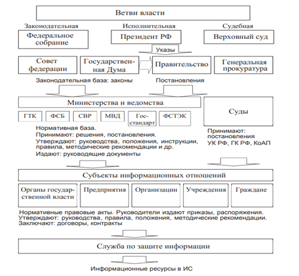
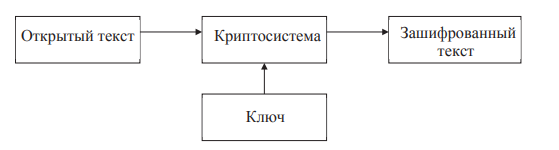

## 1\. Показать связь между уровнем развития общества и технологиями ЗИ

С развитием общества также развиваются технологии. Усложнение технологий приводит к тому, что усложняются методы защиты информации, вместе с ними – методы их обхода. Нагляднее всего это можно отследить на примере развития криптографии: первые исторические шифры являлись простой заменой букв (сдвиг по алфавиту в шифре Цезаря и т. п.), которые были осуществимы вручную; сейчас же методы криптографии, а также криптоанализ, помимо того, что невозможно применить без использования вычислительной техники, также и требуют больших вычислительных мощностей.

## **2\. С чем связан возросший интерес к проблемам ЗИ?**

Развитие технологий приводит к тому, что доступ к различной информации значительно упрощается. Без должного администрирования и защиты информация при такой доступности может быть легко подвержена искажению, уничтожению, а также нарушениям её конфиденциальности. С учётом того, насколько многое завязано именно на обеспечении этих свойств информации, данные проблемы имели первостепенное значение едва ли не всегда, сейчас, из-за причин выше, возникает значительно большее число потенциальных возможностей для злоумышленников и случайных нарушителей к нарушению ИБ. Помимо личных причин, - практически вся информация о человеке достаточно просто ищется в сети, - и коммерческих, - защита коммерческой тайны в условиях большой конкуренции и свободного распространения информации, - в условиях достаточно острой политической ситуации обеспечение информационной безопасности также играет сейчас огромную роль в национальной безопасности.

## **3\. Каковы отличия формального и неформального подхода к проблемам ЗИ**

Формальный основан на понятии политики безопасности и определении способов гарантирования выполнения её положений. Законы, положения, моральные меры и т. п.

Неформальный, или описательный. При этом комплекс вопросов построения защищённых систем делится на основные направления, соответствующие угрозам, разрабатывается комплекс мер и механизмов защиты по каждому направлению. Проблема -> мера

## **4\. В чём заключаются основные трудности обеспечения ИБ в настоящее время?**

Основными трудностями можно считать рост количества информации, из-за лёгкого доступа к сети и, как следствие, чужой технике – рост числа злоумышленников. Из-за того, что технологии стали неотъемлемой частью жизни, многие люди стали сознательно пренебрегать мерами информационной безопасности, что позволяет злоумышленникам совершать атаки. Также одной из серьёзных проблем можно назвать дефицит квалифицированных специалистов в области информационной безопасности: несмотря на то, что сфера ИБ востребована и перспективна, в основном молодые люди предпочитают другие отрасли информационных технологий для карьеры, вероятно, в связи со значительно меньшим количеством правил и нормативов.

## **5\. Что такое ИС (информационная система), АС (Автоматизированная система), ИТС (Информационно-коммуникационная система), КС (Компьютерная система)**

- Информационная система — совокупность содержащейся в базах данных информации и обеспечивающих ее обработку информационных технологий и технических средств  
- Информационно-телекоммуникационная сеть — технологическая система, предназначенная для передачи по линиям связи информации, доступ к которой осуществляется с использованием средств вычислительной техники.  
- Автоматизированная система - это система состоящая из персонала и комплекса средств автоматизации его действий, реализующая информационную технологию выполнения установленных функций.  
- Компьютерная система – это совокупность компьютера, периферийного оборудования и программного обеспечения, предназначенных для подготовки и решения задач пользователя.

## **6\. Дать определение ИБ, БИ, ЗИ**

- Информационная безопасность — состояние защищенности информационных ресурсов (информационной среды) от внутренних и внешних угроз, способных нанести ущерб интересам личности, общества, государства (национальным интересам).  
- Безопасность информации — защищенность информации от нежелательного (для соответствующих субъектов информационных отношений) ее разглашения (нарушения конфиденциальности), искажения (нарушения целостности), утраты или снижения степени доступности информации, а также незаконного ее тиражирования.  
- Защита информации — принятие правовых, организационных и технических мер, направленных: 1) на обеспечение защиты информации от неправомерного доступа, уничтожения, модифицирования, блокирования, копирования, предоставления, распространения, а также от иных неправомерных действий в отношении такой информации; 2) соблюдение конфиденциальности информации ограниченного доступа; 3) реализацию права на доступ к информации.

## **7\. Каковы основные принципы построения систем ЗИ?**

- Законность и обоснованность защиты

- Системность. Предполагает необходимость учета всех взаимосвязанных, взаимодействующих и изменяющихся во времени элементов, условий и факторов.

- Комплексность. Предполагает необходимость учета всех взаимосвязанных, взаимодействующих и изменяющихся во времени элементов, условий и факторов- Непрерывность защиты

- Непрерывность. Разработка системы защиты должна вестись параллельно с разработкой самой защищаемой системы

- Разумная достаточность. Возможно достижение лишь некоторого приемлемого уровня безопасности. Высокоэффективная система защиты требует больших ресурсов (финансовых, материальных, вычислительных, временных) и может создавать ощутимые дополнительные неудобства пользователям. Важно правильно выбрать тот достаточный уровень зашиты, при котором затраты, риск и размер возможного ущерба были бы приемлемыми

- Гибкость. Внешние условия и требования с течением времени меняются. Принятые меры и установленные средства защиты могут обеспечивать как чрезмерный, так и недостаточный уровень защиты. Для обеспечения возможности варьирования уровня защищенности средства защиты должны обладать определенной гибкостью.

- Открытость алгоритмов и механизмов защиты. Знание алгоритмов работы системы защиты не должно давать возможности ее преодоления даже разработчику защиты. Однако это вовсе не означает, что информация о конкретной системе защиты должна быть общедоступна, необходимо обеспечивать защиту от угрозы раскрытия параметров системы.

- простота применения средств защиты. Механизмы защиты должны быть интуитивно понятны и просты в использовании.

## **8\. Сфера действия ФЗ 149 от 27.07.2006.**

ФЗ 149 от 27.07.2006 регулирует отношения, возникающие при:

1) осуществлении права на поиск, получение, передачу, производство и распространение информации;

2) применении информационных технологий;

3) обеспечении защиты информации.

## **9\. Расскажите о стратегии нац безопасности. Утверждена указом президена РФ №400 от 2 июля 2001 года.**

Стратегия национальной безопасности РФ – документ, определяющий национальные интересы и стратегические национальные приоритеты Российской Федерации, цели и задачи государственной политики в области обеспечения национальной безопасности и устойчивого развития Российской Федерации. Указывает такие нац приоритеты как Оборона страны, сбережение народов России, защита традиционных ценностей, государственная и общественная безопасность, информационная, экономическая, экологическая безопасность, стратегическая стабильность

## **10\. Доктрина информационной безопасности Российской Федерации**

Доктрина основывается на стратегии национальной безопасности, утверждённой указом Президента №400, представляет собой систему официальных взглядов на обеспечение национальной безопасности Российской Федерации в информационной сфере. В Доктрине определены национальные интересы в информационной сфере, введены основные информационные угрозы и состояние информационной безопасности, сформулированы стратегические цели и основные направления обеспечения информационной безопасности, описаны организационные основы обеспечения информационной безопасности.

## **11\. Что такое комплексный подход к обеспечению ИБ?**

Комплексный подход – комплексное использование всех известных методов и подходов для обеспечения ИБ. К такому подходу предъявляются определенные требования:  
- Разработка и доведение до уровня регулярного использования всех необходимых механизмов гарантированного обеспечения требуемого уровня защищенности информации

- Существование механизмов практической реализации требуемого уровня защищенности;

- Наличие средств рациональной реализации всех необходимых мероприятий по защите информации на базе достигнутого уровня развития науки и техники;

- Разработка способов оптимальной организации и обеспечения проведения всех мероприятий по защите в процессе обработки информации

## **12\. Каковы основные задачи ЗИ?**

Задачи защиты:

- введение избыточности элементов системы («с запасом», на случай, если какой-либо элемент откажет);

- резервирование элементов системы (способ создания избыточности, введение элементов, не требующихся для работы в нормальном режиме);

- регулирование доступа к элементам системы (регулирование КТО работает с системой);

- регулирование использования элементов системы (регулирование КАК работают с системой);

- маскировка информации (защита информации путём замены исходных данных на некорректные или случайное наполнение);

- контроль элементов системы;

- регистрация сведений;

- уничтожение информации;

- сигнализация (оповещение об изменениях и проблемах в системе);

- реагирование (обнаружение и исправление потенциальных и возникающих проблем).

## 13\. Что такое морально-этические принципы ЗИ?

Морально-этические меры защиты информационной безопасности складываются из традиционно сложившихся в стране или в обществе норм поведения и правил обращения с информацией. Указанные правила чаще не упомянуты в законодательном своде требований, в то же время следствием их несоблюдения является падение авторитета человека или организации. Морально-этические меры бывают в виде общепризнанных норм чести, патриотизма и т.д., а также в виде оформленных в некий свод предписаний или правил.

## **14\. Что такое Центры информационной безопасности (ЦИБ), проведите их классификацию по направлениям деятельности.**

ЦИБ – центры, основные направления деятельности которых — координация усилий, направленных на актуализацию проблем защиты информации, проведение теоретических исследований и разработка конкретных практических решений в области безопасности, аналитическая деятельность и прогнозирование

- Информационно-аналитические. В основном занимаются сбором и распространением информации об известных уязвимых местах систем, атаках и вторжениях, программных и аппаратных средствах профилактики и защиты

- Оперативного реагирования. Ключевым аспектом деятельности является оказание практической помощи тем, чьим интересам был нанесен ущерб в результате нарущения информационной безопасности

- Консультационные. Преимущественно занимаются оказанием консалтинговых услуг организациям, испытывающим трудности с выбором или внедрением программных, аппаратных или комплексных мер защиты, разработкой политики безопасности или использованием нормативно-правовой базы, регламентирующей вопросы применения мер защиты.

- Научно-исследовательские. Сосредоточены на изучении и совершенствовании теоретических основ информационной безопасности, исследовании и разработке моделей безопасных систем, синтезе и анализе защитных механизмов, совершенствовании законодательной базы.

- Центры сертификации. Реализуют программы тестирования, сравнения и сертификации средств защиты, а также разрабатывают подходы к сертификации и методики тестирования.

## **15\. Расскажите об особенностях информации, как об объекте познания**

Информация как объект познания имеет ряд особенностей:

- нематериальна по своей природе, отображается в виде символов на носителях;

- после записи на носитель информация приобретает определённые параметры и может быть измерена в объеме;

- информация, записанная на материальный носитель, может храниться, обрабатываться, передаваться по различным каналам связи;

- перемещаясь по линиям связи, информация создает физические поля, которые отражают ее содержание.

## **16\. Назовите уровни предоставления информации.**

- уровень носителей. Информация, являясь предметом защиты, требует защищенности тех объектов, в которых она присутствует в той или иной материальной форме. Носители имеют две категории информации: информация носителя о себе (форма, размер, хим/физ свойства, энергетические параметры) и семантическая (результат абстрактного мышления на языке символов). Особенности вещественных носителей: придают информации статичность, информация фиксируется и практически не уничтожается без повреждения носителя, со временем разрушаются вместе с информацией, запись связана с изменением физических и химических свойств носителя. Свойства энергетических носителей: используются в основном для передачи информации, не стареют, бесконтрольно распространяются в пространстве, способны к взаимному преобразованию, запись связана с изменением параметров поля.

- уровень средств взаимодействия с носителем. Непосредственное взаимодействие с носителем не всегда возможно и часто осуществляется через сложные технические устройства. Для защиты на этом уровне нужно следить за исправностью устройств считывания информации, за отсутствием технических средств несанкционированного доступа к информации (так называемых «закладок»), задачей которых является перехват или перенаправление потока считываемой информации.

- логический уровень. На логическом уровне в информационной системе информация может быть представлена в виде логических дисков, каталогов, файлов, …, секторов, кластеров. В современных операционных системах уровни отдельных байтов, кластеров, секторов не видны, поэтому часто забываются. Следует помнить, что удаление информации на высоком логическом уровне (например, на уровне файла) не приводит к удалению информации на нижних уровнях, откуда она может быть считана.

- синтаксический уровень. Синтаксический уровень представления информации связан с кодированием. Информация записывается и передаётся при помощи символов. Символ — это некоторый знак, которому придаётся определённый смысл. Линейный набор символов образует алфавит. В процессе кодирования один алфавит может быть преобразован в другой.

- семантический уровень. Семантический уровень связан со смыслом передаваемой информации. Одинаковые лексические конструкции могут иметь различный смысл в разном контексте. Использование профессионализмов, многозначных слов и слов, значение которых изменилось с течением времени, может исказить смысл информации.

## **17\. Дайте определение основным свойствам информации.**

- Секретность (конфиденциальность) информации — субъективно определяемая характеристика информации, указывающая на необходимость введения ограничений на круг субъектов, имеющих доступ к данной информации. Эта характеристика обеспечивается способностью системы сохранять указанную информацию в тайне от субъектов, не имеющих полномочий на доступ к ней.

- Целостность информации — свойство информации существовать в неискаженном виде. Обычно интересует обеспечение более широкого свойства — достоверности информации, которое складывается из адекватности (полноты и точности) отображения состояния предметной области и непосредственно целостности информации, то есть ее неискаженности. Вопросы обеспечения адекватности отображения выходят за рамки проблемы обеспечения информационной безопасности.

- Доступность информации — свойство системы, в которой циркулирует информация, обеспечивать своевременный беспрепятственный доступ субъектов к интересующей их информации и готовность к обслуживанию поступающих от субъектов запросов всегда, когда в обращении к ним возникает необходимость

## **18\. Что относят к прагматическим свойствам информации?**

Прагматические свойства:

- важность (ценность, полезность) - пригодность ее для достижения цели. Может быть полезной, бесполезной и вредной.

- полнота (степень уменьшения априорной неопределенности) - достаточность информации для реализации цели. К отрицательным значениям относят неполную и избыточную информацию

- достоверность - надежность, доказуемость, проверяемость информации

- своевременность - поступление информации в пределах того времени, когда она необходима для принятия решения. Своевременность предполагает поступление информации в нужный момент, согласованный со временем принятия решения.

- целесообразность - изменение вероятности достижения цели при получении дополнительной информации;

- соотносимость с фактами, явлениями.

## **19\. Что включают в себя информационные ресурсы организаций, предприятий и структур**

Информационные ресурсы предприятия, организации, учреждения, компании и других государственных и негосударственных структур включают в себя отдельные документы и отдельные массивы документов (дела), документы и комплексы документов в информационных системах (библиотеках, архивах, фондах, банках данных электронно-информационных систем) на любых носителях, в том числе обеспечивающих работу вычислительной и организационной техники.

## **20\. Какие стандартные реквизиты должна иметь любая документированная информация**

Любая документированная информация имеет следующие реквизиты:

- наименование документа;

- гриф секретности или конфиденциальности (если таковые имеются);

- регистрационный номер;
- дату создания и регистрации;
- автора и (или) исполнителя;

- срок действия грифа секретности или конфиденциальности, если таковые имеются;

- атрибуты учреждения

## **21\. Что характеризует степень ценности информации? Какие существуют виды интеллектуально-ценной информации?**

Ценность информации может быть стоимостной категорией и характеризовать конкретный размер прибыли при ее использовании или размер убытков при ее утрате. Степень ценности информации и необходимая надежность ее защиты находятся в прямой зависимости. Информация часто становится ценной ввиду ее правового значения для фирмы или развития бизнеса, например учредительные документы, программы и планы, договоры с партнерами и посредниками и т.д. Ценность может проявляться в ее перспективном научном, техническом или технологическом значении.

Интеллектуально-ценная информация:

- техническая, технологическая: методы изготовления продукции, программное обеспечение, производственные показатели, химические формулы, рецептуры, результаты испытаний опытных образцов, данные контроля качества и т.п.;

- деловая: стоимостные показатели, результаты исследования рынка, списки клиентов, экономические прогнозы и т.п.

## **22\. Проведите классификацию информационных ресурсов**

Информационные ресурсы могут быть открытыми, то есть общедоступными (используемыми в работе без специального разрешения, публикуемыми в средствах массовой информации, оглашаемыми в выступлениях и т.п.), и ограниченного доступа и использования, то есть содержащими сведения, составляющие тот или иной вид тайны и подлежащие защите, охране, наблюдению

## **23\. Что такое тайна? Назовите предметную сферу тайны**

Тайна — это нечто неизвестное, неведомое, неразгаданное, еще не познанное, нечто скрываемое от других, известное не всем. Выделяются две глобальные предметные сферы тайны:

- тайны природы, то есть объективные тайны: тайна Вселенной, тайны рождения и смерти и множество других тайн;

- тайны людей, то есть субъективные тайны: тайны личности, тайны производства, тайны искусства и т.п

В понятие тайны включается не только документированная информация, а также базы данных, продукция, изделия, технологии, излучения, физические поля.

## **24\. Назовите основные виды тайн (6 штук)**

- Государственная тайна — защищаемые государством сведения в области военной, внешнеполитической, экономической, разведывательной, контрразведывательной и оперативно-розыскной деятельности, распространение которых может нанести ущерб безопасности Российской Федерации.

- Служебная тайна содержит информацию ограниченного распространения, к которой относятся несекретные сведения, касающиеся деятельности организации, ограничения на распространение которых диктуются служебной необходимостью. К служебной информации относятся сведения, не подлежащие опубликованию в средствах массовой информации, использованию в открытых документах, оглашению на конференциях, переговорах и выставках, например, черновики и варианты готовящихся документов, служебные инструкции, тактика ведения переговоров, персональные данные работников и т.д

- Профессиональная тайна — инструмент защиты персональных данных о гражданах и личной тайны граждан. Имеется в виду, что эти сведения переданы их собственником или находятся в распоряжении той или иной организации и необходимы ей для выполнения профессиональной деятельности

- Коммерческая тайна — сведения, имеющие действительную или потенциальную коммерческую ценность в силу неизвестности их третьим лицам, когда к ним нет свободного доступа на законном основании и обладатель этих сведений принимает меры к охране их конфиденциальности.

- Личная тайна граждан определена в Конституции Российской Федерации, где указано, что каждый имеет право на неприкосновенность частной жизни, личную и семейную тайну, защиту своей чести и доброго имени. Каждый имеет право на тайну переписки, телефонных переговоров, почтовых, телеграфных и иных сообщений. Не допускается сбор, хранение, использование и распространение информации о частной жизни граждан без их согласия

- Семейную тайну можно считать разновидностью личной тайны. Она представляет собой тайну нескольких лиц, связанных родством, например: имущественное положение, взгляды и убеждения, отношения в семье, тайна факта усыновления.

## **25\. Дайте определение коммерческой тайны**

Коммерческая тайна — сведения, имеющие действительную или потенциальную коммерческую ценность в силу неизвестности их третьим лицам, когда к ним нет свободного доступа на законном основании и обладатель этих сведений принимает меры к охране их конфиденциальности. Учитывая, что коммерческая тайна как таковая отражает в значительной степени торговые секреты, иногда в рамках этого же определения используется термин «предпринимательская тайна». В зарубежной практике обычно используются термины, разделяющие предпринимательскую тайну на две части — производственную и коммерческую. Коммерческая тайна рассматривается как обязательное условие добросовестной конкуренции предприятий на рынке товаров или услуг. В России коммерческая тайна охватывает негосударственную сферу или коммерческие направления производственной деятельности и включает производственную, финансовую, научную и другие подвиды тайны. В рамках этого вида тайны выделяется коммерческая тайна банка (банковская тайна), тайна фирмы. К коммерческой тайне относятся секреты предприятий, с которыми сотрудничает фирма, секреты клиентов, покупателей, поставщиков и т.п.

## **26\. Какие сведения в соответствии с законодательством РФ не разрешается относить к информации ограниченного доступа?**

Запрещается относить к информации ограниченного доступа:

- законодательные и другие нормативные акты, устанавливающие правовой статус органов государственной власти, исполнительных органов, органов местного самоуправления, организаций, общественных объединений, а также права, свободы и обязанности граждан, порядок их реализации;

- документы, содержащие информацию о чрезвычайных ситуациях, экологическую, метеорологическую, демографическую, санитарно-эпидемиологическую и другую информацию, необходимую для обеспечения безопасного функционирования населенных пунктов, производственных объектов, безопасности граждан и населения в целом;

- документы, содержащие информацию о деятельности органов государственной власти, исполнительных органов и органов местного самоуправления, об использовании бюджетных средств и других государственных и местных ресурсов, о состоянии и потребностях населения, за исключением сведений, относящихся к государственной тайне;

- документы, накапливаемые в открытых фондах библиотек и архивов, информационных системах органов государственной власти, исполнительных органов, органов местного самоуправления, организаций, общественных объединений, представляющие общественный интерес или необходимые для реализации прав, свобод и обязанностей граждан.

## *27\. Какое назначение имеет перечень сведений составляющих коммерческую тайну и иную конфиденциальную информацию?*

## **28\. Каково место информационной безопасности в системе национальной безопасности РФ?**

Под национальной безопасностью понимается состояние защищенности жизненно важных национальных интересов от внутренних и внешних угроз, при котором обеспечивается реализация конституционных прав и свобод граждан Российской Федерации, достойные качество и уровень их жизни, суверенитет, независимость, государственная и территориальная целостность, устойчивое социально-экономическое развитие Российской Федерации. Поскольку в условиях информатизации страны, развития информационных технологий информационные ресурсы формируются во всех сферах деятельности, и в первую очередь в политической, военной, экономической, научно-технической, информационную безопасность следует рассматривать как комплексный показатель национальной безопасности. Этим определяется ее важное место и одна из ведущих ролей в системе национальной безопасности страны в современных условиях.

## **29\. Расскажите об основных положениях доктрины информационной безопасности**

- Определение национальных интересов в информационной сфере, перечисление основных информационных угроз (среди них - наращивание рядом зарубежных стран возможностей информационно-технического воздействия на информационную инфраструктуру в военных целях, усиливающаяся разведывательная деятельность в отношении российских государственных органов, научных организаций и предприятий оборонно-промышленного комплекса.)

- Определение стратегических целей обеспечения информационной безопасности (защита суверенитета, поддержание политической и социальной стабильности, территориальной целостности Российской Федерации, обеспечение основных прав и свобод человека и гражданина, а также защита критической информационной инфраструктуры) и её направлений (противодействие использованию информационных технологий для пропаганды экстремистской идеологии, распространение ксенофобии, идей национальной исключительности)

- Описание принципов деятельности и задач гос органов по её обеспечению

## **30\. Что входит в систему национальной безопасности РФ?**

Систему национальной безопасности Российской Федерации образуют:

- органы законодательной, исполнительной и судебной властей;

- государственные, общественные и иные организации и объединения;

- граждане, принимающие участие в обеспечении безопасности в соответствии с законом;

- законодательство, регламентирующее отношения в сфере безопасности.

## **31\. Что включают в себя силы обеспечения национальной безопасности РФ?**

Силы обеспечения безопасности включают в себя:

- Вооруженные силы (ВС РФ);

- федеральные органы безопасности (ФСБ РФ);

- органы внутренних дел (МВД РФ);

- органы внешней разведки (СВР РФ);

- органы обеспечения безопасности органов законодательной, исполнительной, судебной властей и их высших должностных лиц;

- налоговую службу;

- службы ликвидации последствий чрезвычайных ситуаций (МЧС РФ);

- формирования гражданской обороны;

- пограничные войска;

- внутренние войска;

- органы, обеспечивающие безопасное ведение работ в промышленности, энергетике, на транспорте и в сельском хозяйстве;

- таможни, природоохранительные органы, органы охраны здоровья населения и другие государственные органы обеспечения безопасности.

## **32\. Какова структура государственной системы защиты информации?**

## **33\. Кто несет ответственность за нарушение режима защиты информации в организации?**

По большей части в организациях установлены подписные документы, регулирующие защищаемую теми или иными нормативами информацию. Таким образом, ответственность за нарушение режима защиты информации лежит на любом сотруднике, подписавшем эти документы.

## **34\. Что такое угроза информационной безопасности? По каким признакам классифицируются угрозы?**

Угроза — это фактор, стремящийся нарушить работу системы.

Классификация угроз по следующим признакам:

1.  Природа возникновения: естественные угрозы (связанные с природными процессами) и искусственные (вызванные деятельностью человека)
2.  Степень преднамеренности проявления: случайные или преднамеренные.
3.  Источник угроз: природная среда, человек, санкционированные программно-аппаратные средства, несанкционированные программно-аппаратные средства.
4.  Положение источника угроз: в пределах или вне контролируемой зоны.
5.  Зависимость от активности системы: проявляются только в процессе обработки данных или в любое время.
6.  Степень воздействия на систему: пассивные, активные(вносят изменения в структуру и содержание системы).
7.  Этап доступа к ресурсам: на этапе доступа, после получения доступа.
8.  Способ доступа к ресурсам: стандартный, нестандартный.
9.  Место расположения информации: внешние носители, оперативная пaмять, линии связи, устройства ввода-вывода.

## **35\. Расскажите об основных видах угроз: нарушение конфиденциальности, целостности и доступности**

- Угроза нарушения конфиденциальности реализуется в том случае, если информация становится известной лицу, не располагающему полномочиями доступа к ней. Угроза нарушения конфиденциальности имеет место всякий раз, когда получен доступ к некоторой секретной информации, хранящейся в информационной системе или передаваемой от одной системы к другой. Иногда в связи с угрозой нарушения конфиденциальности используется термин «утечка».

- Угроза нарушения целостности реализуется при несанкционированном изменении информации, хранящейся в информационной системе или передаваемой из одной системы в другую. Когда злоумышленники преднамеренно изменяют информацию, говорится, что целостность информации нарушена. Целостность также будет нарушена, если к несанкционированному изменению приводит случайная ошибка программного или аппаратного обеспечения. Санкционированными изменениями являются те, которые сделаны уполномоченными лицами с обоснованной целью (например, санкционированным изменением является периодическая запланированная коррекция некоторой базы данных).

- Угроза нарушения доступности (отказа служб) реализуется, когда в результате преднамеренных действий, предпринимаемых другим пользователем или злоумышленником, блокируется доступ к некоторому ресурсу вычислительной системы. Блокирование может быть постоянным — запрашиваемый ресурс никогда не будет получен, или может вызывать только задержку запрашиваемого ресурса

## **36\. В чём различие понятий нарушения конфиденциальности информации, несанкционированного доступа к информации и утечка информации?**

Нарушение конфиденциальности – более общий термин, в который входят оставшиеся два. Это, как раз, незаконное разглашение, использование или несанкционированный доступ к конфиденциальной информации – любое нарушение по части конфиденциальности.

Несанкционированным доступом к информации является доступ к информации, нарушающий установленные правила разграничения доступа, может носить случайный или преднамеренный характер. Термин больше ориентирован на действие нарушителя, чем на состояние информации.

Утечка информации — это несанкционированный доступ, неконтролируемое распространение или потеря конфиденциальных данных, которые могут быть личными, коммерческими или государственными. Термин больше ориентирован на состояние информации, чем на действия

## **37\. В чём различие между нарушителем ИБ и злоумышленником? С какой целью разрабатывается неформальная модель нарушителя?**

Нарушитель — это лицо, предпринявшее попытку выполнения запрещенных операций (действий) по ошибке, незнанию или осознанно со злым умыслом (из корыстных интересов) или без такового.

Злоумышленник — нарушитель, намеренно идущий на нарушение из корыстных побуждений.

Неформальная модель нарушителя отражает его практические и теоретические возможности, априорные знания, время и место действия и т.п. Исследовав причины нарушений, можно либо повлиять на сами эти причины, либо точнее определить требования к системе защиты от данного вида нарушений или преступлений.

## **38\. Проведите классификацию нарушителей**

_По уровню знаний о системе:_

1. знание функциональных особенностей, основных закономерностей формирования в системе массивов данных и потоков запросов к ним, умение пользоваться штатными средствами;

2. обладание высоким уровнем знаний и опытом работы с техническими средствами системы, а также опытом их обслуживания;

3. обладание высоким уровнем знаний в области программирования и вычислительной техники, проектирования и эксплуатации автоматизированных информационных систем;

4. знание структуры, функций и механизмов действия средств защиты, их сильные и слабые стороны.

_По уровню возможностей:_

1. запуск задач (программ) из фиксированного набора, реализующих заранее предусмотренные функции по обработке информации

2. возможность создания и запуска собственных программ с новыми функциями по обработке информации

3. возможность управления функционированием системы, т. е. воздействием на базовое программное обеспечение системы и на состав и конфигурацию ее оборудования.

4. весь объем возможностей лиц, осуществляющих проектирование, реализацию и ремонт технических средств системы, вплоть до включения в состав собственных технических средств с новыми функциями по обработке информации

_По времени действия:_

- в процессе функционирования (во время работы компонентов системы);

- в период неактивности компонентов системы (в нерабочее время, во время плановых перерывов в ее работе, перерывов для обслуживания и ремонта и т.п.);

- как в процессе функционирования, так и в период неактивности компонентов системы.

_По месту действия_

- без доступа на контролируемую территорию организации;

- с контролируемой территории без доступа в здания и сооружения;

- внутри помещений, но без доступа к техническим средствам;

- с рабочих мест конечных пользователей (операторов);

- с доступом в зону данных (баз данных, архивов и т.п.);

- с доступом в зону управления средствами обеспечения безопасности

## **39\. Дайте определение термину Несанкционированный доступ к информации**

Несанкционированным доступом к информации является доступ к информации, нарушающий установленные правила разграничения доступа, может носить случайный или преднамеренный характер. Для преднамеренного используются как общедоступные, так и скрытые способы и средства: предательство, подкуп и шантаж, всякие подслушивания-подглядывания, фотографирование, перехват передаваемых по различным каналам данных, незаконное к ним подключение, сбор и аналитическая обработка детальной информации или производственных отходов.

К основным способам относятся: непосредственное обращение к объектам доступа, создание программных и технических средств, выполняющих обращение в обход средств защиты, модификация имеющихся средств защиты, внедрение в техсредства информационной системы механизмов, нарушающих предполагаемую структуру и функции системы, и позволяющих осуществить НСД

## **40\. Дать определение термину Защита информации от утечки**

Защита информации от утечки — деятельность, направленная на предотвращение неконтролируемого распространения защищаемой информации в результате ее разглашения, несанкционированного доступа к информации и получения защищаемой информации разведками.

## **41\. Проведите классификацию каналов утечки информации по физическим признакам**

Каналы утечки информации по физическим принципам можно разделить на следующие группы:

- акустические (включая и акустопреобразовательные). Связаны с распространением звуковых волн в воздухе или упругих колебаний в других средах;

- электромагнитные (в том числе магнитные и электрические); · визуально-оптические (наблюдение, фотографирование). В качестве средства выделения информации в данном случае могут рассматриваться фото-, видеокамеры и т.п.;

- материально-вещественные (бумага, фото, магнитные носители, отходы и т.п.);

- информационные. Связаны с доступом к элементам системы, носителям информации, самой вводимой и выводимой информации, к программному обеспечению, а также с подключением к линиям связи.

На практике часто также делятся на

- технические (акустические, визуально-оптические, электромагнитные)

- информационные

## **42\. Дать определение терминам идентификация и аутентификация**

Идентификация — процедура, в результате выполнения которой для субъекта идентификации выявляется его идентификатор, однозначно определяющий этого субъекта в информационной системе.

Аутентификация — процедура проверки подлинности, например проверка подлинности пользователя путем сравнения введенного им пароля с паролем, сохраненным в базе данных.

## **43\. На примере простейшей схемы расскажите о шифровании и дешифровании**

## **44\. Расскажите об организационных методах защиты целостности информации при хранении**

Эффективная защита информации возможна при обязательном выполнении ряда условий:

- единство в решении производственных, коммерческих, финансовых и режимных вопросов;

- координация мер безопасности между всеми заинтересованными подразделениями предприятия;

- научная оценка информации и объектов, подлежащих классификации (защите); разработка режимных мер до начала проведения режимных работ;

- персональная ответственность (в том числе и материальная) руководителей всех уровней, исполнителей, участвующих в закрытых работах, за обеспечение сохранности тайны и поддержание на должном уровне режима охраны проводимых работ;

- включение основных обязанностей рабочих, специалистов и администрации по соблюдению конкретных требований режима в коллективный договор, контракт, трудовое соглашение, правила трудового распорядка;

- организация специального делопроизводства, порядка хранения, перевозки носителей тайны; введение соответствующей маркировки документов и других носителей закрытых сведений;

- формирование списка лиц, уполномоченных руководителем предприятия классифицировать информацию и объекты, содержащие конфиденциальные сведения;

- оптимальное ограничение числа лиц, допускаемых к защищаемой информации;

- наличие единого порядка доступа и оформления пропусков;

- выполнение требований по обеспечению сохранения защищаемой информации при проектировании и размещении специальных помещений, в процессе опытно-конструкторской разработки, испытаний и производства изделий, сбыта, рекламы, подписания контрактов, при проведении особо важных совещаний, в ходе использования технических средств обработки, хранения и передачи информации и т.п.;

- организация взаимодействия с государственными органами власти, имеющими полномочия по контролю определенных видов деятельности предприятий и фирм; · наличие охраны, пропускного и внутриобъектового режимов;

- плановость разработки и осуществления мер по защите информации, систематический контроль за эффективностью принимаемых мер;

- создание системы обучения исполнителей правилам обеспечения сохранности информации.

## **45\. Расскажите о мерах защиты информации на уровне содержания. Наиболее распространённые приёмы дезинформации**

Для сокрытия истинного содержания сообщения могут применяться различные приемы, суть которых сводится к тому, что в соответствие одной последовательности знаков или слов одного языка ставятся знаки или слова другого.

Другим направлением защиты является использование стеганографии. Слово «стеганография» в переводе с греческого буквально означает «тайнопись». К ней относится огромное множество секретных средств связи, таких как невидимые чернила, микрофотоснимки, условное расположение знаков (применяемое в сигнальной агентурной связи), цифровые подписи, тайные каналы и средства связи на плавающих частотах. Большинство из компьютерных стеганографических приемов объединяет методология изменения наименьшего значимого бита (Least Significant Bits-LSB), который считается «шумящим», т. е. имеющим случайный характер в отдельных байтах файла-«контейнера». На практике в большинстве случаев открытый контейнер не содержит бесполезных данных, которые могут быть использованы для модификации. Вместо этого контейнерные файлы естественно содержат различные уровни шума, который при ближайшем рассмотрении, за исключением остальной части байта, может являться произвольной величиной.

Наиболее распространенные приемы дезинформации:

- прямое сокрытие фактов;

- тенденциозный подбор данных;

- нарушение логических и временных связей между событиями;

- подача правды в таком контексте (добавлением ложного факта или намека), чтобы она воспринималась как ложь;

- изложение важнейших данных на ярком фоне отвлекающих внимание сведений;

- смешивание разнородных мнений и фактов;

- изложение данных словами, которые можно истолковывать по-разному;

- отсутствие упоминания ключевых деталей факта.

## **46\. Дайте определение термину политика безопасности**

Под политикой безопасности понимается совокупность норм и правил, регламентирующих процесс обработки информации, выполнение которых обеспечивает защиту от определенного множества угроз и составляет необходимое условие безопасности системы. Формальное выражение политики безопасности называют моделью безопасности.

## **47\. В силу каких факторов и обстоятельств проблемы обеспечения информационной безопасности в современных условиях приобретают первостепенное значение**

Развитие технологий приводит к тому, что доступ к различной информации значительно упрощается. Без должного администрирования и защиты информация при такой доступности может быть легко подвержена искажению, уничтожению, а также нарушениям её конфиденциальности. С учётом того, насколько многое завязано именно на обеспечении этих свойств информации, данные проблемы имели первостепенное значение едва ли не всегда, сейчас, из-за причин выше, возникает значительно большее число потенциальных возможностей для злоумышленников и случайных нарушителей к нарушению ИБ. Помимо личных причин, - практически вся информация о человеке достаточно просто ищется в сети, - и коммерческих, - защита коммерческой тайны в условиях большой конкуренции и свободного распространения информации, - в условиях достаточно острой политической ситуации обеспечение информационной безопасности также играет сейчас огромную роль в национальной безопасности.

## **48\. На что направлена защита информации? Сформулируйте цели защиты информации**

Защита информации направлена на обеспечение безопасности информации, безопасность информации обеспечивается с помощью ее защиты. При этом, безопасность информации – защищённость информации от нежелательного её разглашения, искажения, утраты или снижения степени доступности информации, а также незаконного ее тиражирования. Цели:

- предотвращение утечки, хищения, утраты, искажения, подделки информации;

- предотвращение угроз безопасности личности, общества, государства;

- предотвращение несанкционированных действий по уничтожению, модификации, искажению, копированию, блокированию информации; предотвращение других форм незаконного вмешательства в информационные ресурсы и информационные системы, обеспечение правового режима документированной информации как объекта собственности;

- защита конституционных прав граждан на сохранение личной тайны и конфиденциальности персональных данных, имеющихся в информационных системах;

- сохранение государственной тайны, конфиденциальности документированной информации в соответствии с законодательством;

- обеспечение прав субъектов в информационных процессах и при разработке, производстве и применении информационных систем, технологий и средств их обеспечения.

## **49\. Расскажите об участниках системы информационной безопасности**

По доктрине ИБ:

Участниками системы обеспечения информационной безопасности являются: собственники объектов критической информационной инфраструктуры и организации, эксплуатирующие такие объекты, средства массовой информации и массовых коммуникаций, организации денежно-кредитной, валютной, банковской и иных сфер финансового рынка, операторы связи, операторы информационных систем, организации, осуществляющие деятельность по созданию и эксплуатации информационных систем и сетей связи, по разработке, производству и эксплуатации средств обеспечения информационной безопасности, по оказанию услуг в области обеспечения информационной безопасности, организации, осуществляющие образовательную деятельность в данной области, общественные объединения, иные организации и граждане, которые в соответствии с законодательством Российской Федерации участвуют в решении задач по обеспечению информационной безопасности.

## **50\. На какие два класса разделяются угрозы безопасности информации**

По факторам возникновения делят на :

- Естественные (стихийные бедствия — пожар, наводнение, ураган, молния и другие причины)

- Искуственные, они же человеческие факторы. Могут быть умышленными (делятся на активные/пассивные и внешние/внутренние) и неумышленными.

## **51\. На какие четыре класса делятся т. н. вредительские программы? Расскажите о них.**

- Логические бомбы, находятся в системе постоянно, но выполняются только при соблюдении определённых условий (заданная дата, переход в определённый режим работы и т п)

- Черви – имеют способность перемещаться в вычислительной системе или самовоспроизводить копии. Лавинообразное размножение программ приводит к перегрузке каналов связи, памяти и, в конечном итоге, к блокировке системы

- Троянские кони - программы, полученные путем явного изменения или добавления команд в пользовательские программы. При последующем выполнении пользовательских программ наряду с заданными функциями выполняются несанкционированные, измененные или какие-то новые функции.

- Компьютерные вирусы - программы, которые после внедрения в ЭВМ самостоятельно распространяются путем создания своих копий, а при выполнении определенных условий оказывают негативное воздействие на компьютерные системы.

Несмотря на то, что практически все вредоносы называют вирусами, на данный момент именно этого типа программ не так много: из-за развивающихся мер безопасности многие пути для самостоятельного распространения вирусов от компьютера к компьютеру оказываются закрыты, по большей части вредоносные программы распространяются посредством пренебрежения пользователем мер безопасности. Наиболее часто сейчас встречаются троянские кони.

## **52\. Перечислите степени секретности государственной тайны. Формы допуска к сведениям, составляющим государственную тайну.**

Устанавливаются три степени секретности сведений, составляющих государственную тайну, и соответствующие этим степеням грифы секретности для носителей указанных сведений: "особой важности" (сведения в области военной, внешнеполитической, экономической, научно-технической, разведывательной, контрразведывательной и оперативно-разыскной деятельности, распространение которых может нанести ущерб интересам Российской Федерации в одной или нескольких из перечисленных областей), "совершенно секретно" (сведения в области военной, внешнеполитической, экономической, научно-технической, разведывательной, контрразведывательной и оперативно-разыскной деятельности, распространение которых может нанести ущерб интересам министерства (ведомства) или отрасли экономики Российской Федерации в одной или нескольких из перечисленных областей ) и "секретно" (все иные сведения из числа сведений, составляющих государственную тайну).

## **53\. Какую роль играет подготовленность персонала в построении системы безопасности.**

Подготовленность персонала позволяет оперативно реагировать на отклонения от стандартного порядка деятельности, предполагать пути возникновения угроз и принимать необходимые меры. Персонал должен знать о ценности информации, с которой работает, о мерах безопасности и об ответственности за нарушения.

## **54\. С какой целью ЗИ применяет способ дублирования информации.**

Оно обеспечивает защиту информации, как от случайных угроз, так и от преднамеренных воздействий. Это один из примеров мер избыточности при построении системы защиты. Дополнительные копии помогают восстановить информацию при её утере или искажении вне зависимости от причины произошедшего. Методы дублирования делятся на оперативные (переход к использованию дублирующей информации осуществляется за время, которое позволяет выполнить запрос на использование информации в режиме реального времени) и неоперативные. Методы: полного копирования (все файлы), зеркального копирования (вместе с любыми новыми изменениями), частичного копирования (определенные файлы), комбинирование (допускает несколько методов)

## **55\. Дать определение базовым понятиям теории ЗИ: Информационная безопасность, Безопасность ин-ции, информация.**

- Информационная безопасность — состояние защищенности информационных ресурсов (информационной среды) от внутренних и внешних угроз, способных нанести ущерб интересам личности, общества, государства (национальным интересам).  
- Безопасность информации — защищенность информации от нежелательного (для соответствующих субъектов информационных отношений) ее разглашения (нарушения конфиденциальности), искажения (нарушения целостности), утраты или снижения степени доступности информации, а также незаконного ее тиражирования.

Информация — сведения (сообщения, данные) независимо от формы их представления.

## *56\. Охарактеризовать четыре основных постулата в области ЗИ*

## **57\. Морально-этические меры обеспечения ИБ.**

Морально-этические меры защиты информационной безопасности складываются из традиционно сложившихся в стране или в обществе норм поведения и правил обращения с информацией. Указанные правила чаще не упомянуты в законодательном своде требований, в то же время следствием их несоблюдения является падение авторитета человека или организации. Морально-этические меры бывают в виде общепризнанных норм чести, патриотизма и т.д., а также в виде оформленных в некий свод предписаний или правил.

## **58\. Приведите определение информации и информационных ресурсов.**

Информация — сведения (сообщения, данные) независимо от формы их представления.

Информационный ресурс (определения разнятся от источника к источнику, представлено наиболее общее) - это классифицированная совокупность информационных материалов в форме, обеспечивающей их автоматизированный поиск, отбор и предоставление пользователю АС. Могут быть открытыми (общедоступнными) и ограниченного доступа (государственная тайна и иные виды тайн)

## **59\. ФСТЭК, ФСБ, МВД. Назвать основные функции приведённых выше организаций в сфере ЗИ.**

ФСТЭК - федеральная служба технического и экспортного контроля. Осуществляет:

* координацию деятельности органов и организаций в области защиты информации, обрабатываемой техническими средствами;

* обеспечения защиты информации при помощи технических средств;

* организационно-методическое руководство деятельностью по защите информации;

* разработку и финансирование научно-технических программ по защите информации;

* утверждение нормативно-технической документации;

* функции государственного органа по сертификации продукции по требованиям безопасности информации;

* лицензирование деятельности предприятий по оказанию услуг в области защиты информации.

ФСБ – федеральная служба безопасности. Выполняет функции:

* при формировании и реализации государственной и научно-технической политики в области обеспечения информационной безопасности, в том числе с использованием инженерно-технических и криптографических средств;

* при обеспечении криптографическими и инженерно-техническими методами безопасности информационно-телекоммуникационных систем, а также систем шифрованной, засекреченной и иных видов специальной связи в России и её учреждениях, находящихся за пределами России;

* лицензирования и сертификации отдельных видов деятельности, предусматривающих допуск к государственной тайне Российской Федерации.

МВД – министерство внутренних дел. Органы МВД ведут борьбу с правонарушителями в информационной сфере и компьютерными преступлениями. Для этого в структуре МВД создано специальное управление «Р» для предотвращения и раскрытия компьютерных преступлений.

## **60\. Перечислите категории субъектов информационных отношений.**

- Органы государственной власти

- Предприятия

- Организации

- Учреждения

- Граждане