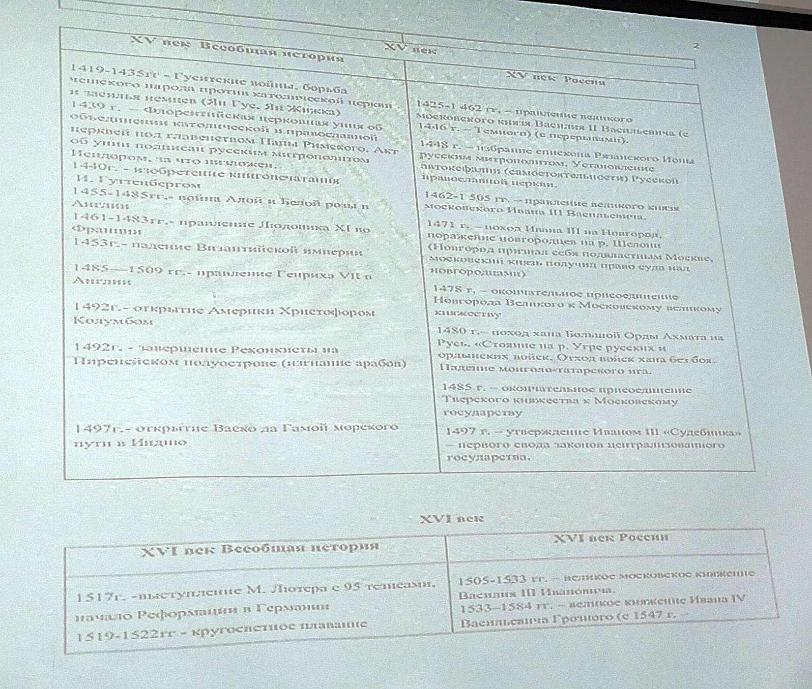
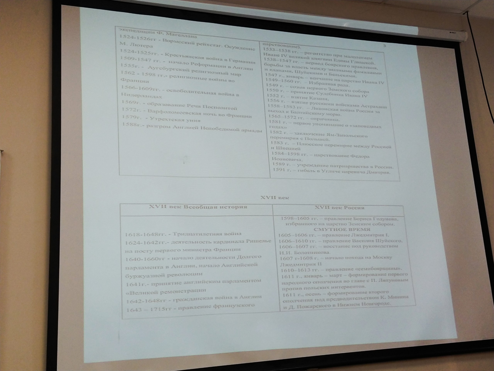
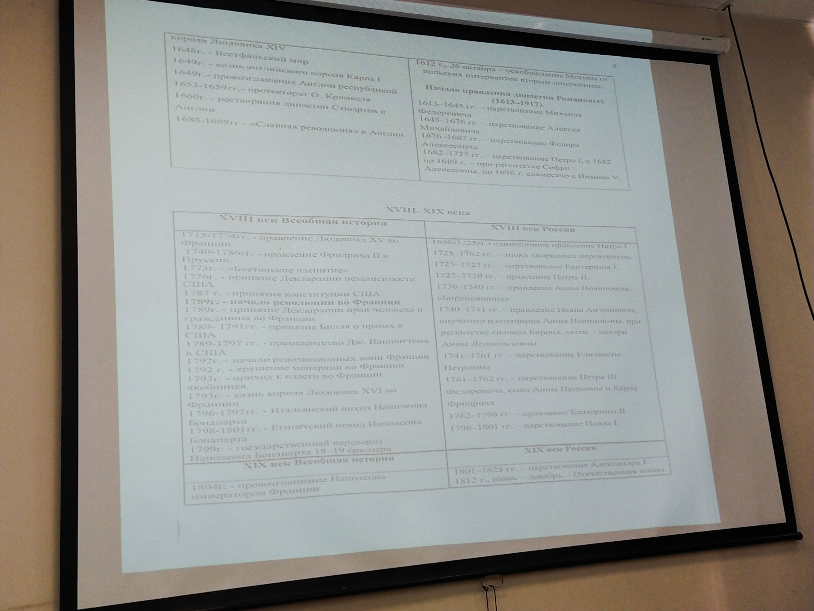
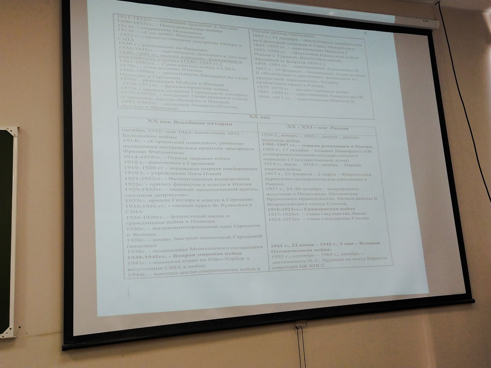
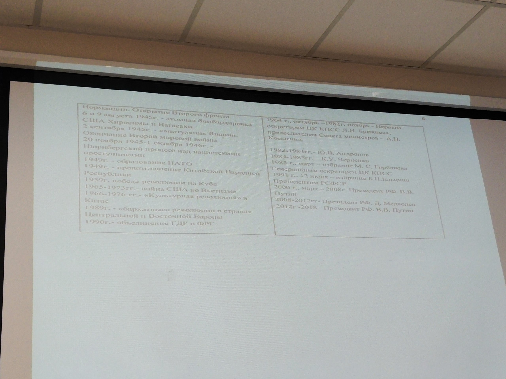

# Лекция 1. Часть 1. 

# Теория и методология исторической науки. 

> Вопросы: 
> 1. История как наука.
> 2. Методология исторической науки.
> 3. Роль исторических источников в изучении истории. 

## 1. История как наука. 

Определения:
* История (наставница жизни) - наука о прошлом, пошла с Геродота.
* История - взаимосвязанный процесс развития природы и общества.
* История - наука о процессах взаимосвязанного развития природы и общества.

### Предмет и объект исторической науки.

Предмет исторической науки - анализ прошлого и выведение закономерностей. 

**Предмет** - особенности социальной, экономической, политической, культурной и прочих сфер жизни конкретного общества в прошлом, совокупность отношений в обществе и в их развитии.

**Объект** - всё прошлое человечества, конкретное общество в конкретный исторический период, конкретные факты. 

Функции истории:
* Познавательная - изучение исторического пути стран 
* Практически-политическая - выявление закономерностей, выработка научно-обоснованного политического курса. 
* Мировозренческая - научное мировозрение, основанное на истории. 
* Воспитательная - гражданские нравственные качества (патриотизм, толерантность, честь, долг...) 
* Функция социальной памяти - обеспечение связи между прошлым и настоящим

### Подходы к изучению: 

* **Формационный (Стадиальный)** - рассмотрение и сравнение экономических систем в разрезе времени. 

* **Цивилизационный** - рассмотрение и сравнение экономических систем в пространстве. 

### Концепции исторического развития: 

**Цивилизационный** - мировая история состоит из историй отдельных локальных цивилизаций, каждая проходит стадию зарождения, роста, надлома, спада.
Основоположники: Данилевский (12 "культурно-исторических типов": 
египетский, китайский, ассиро-вавилоно-финский, индийский, иранский, еврейский, греческий, римский, аравийский, германо-романский, мексиканский и перуанский),Шпенглер (8 типов, разделение основано на территориальных почвах)
Тойнби (13 типов, разделение основано на религиозных почвах)

**Плюсы подхода**: 
позволяет изучать историю во всем её многообразии
ориентирует на изучене тех сторон, которые обычно выпадают у сторонников формационного подхода (ценности, психология)
в центр исследования ставится человек и его деятельность

**Минусы**:
становится невозможен взгляд на историю как на единый процесс
создает возможность полного отрицания единства истории

**Стадиальный (формационный)** - история всего мира - единый процесс; чёткие стадии развития общества (стандартизированные).
Основоположники: Владимир Ильич Ленин, И.В.Сталин, Г.В.Плеханов, Карл Маркс

Общественно-экономические формации: 

* *Первобытная ОЭФ.*
Присваивающий тип хозяйства (собирательство, охота)
Нет частной собственности, строя общества, соц равенства, гос-ва. 

* *Рабовладельческая ОЭФ.*
Частная собственность,  хозяйство реализуюется за счёт рабовладельческого строя.
Классы: рабы и рабовладельцы.
Функция - подавление споротивления рабского класса. 

* *Феодальная ОЭФ.*
Частная собственность, хозяйство на мелкотоварном натуральном основано на эксплуатации феодалами юридически и экономически зависимых крестьян.
Классы: Феодалы, крестьяне.
Функция - подавление сопротивления эксплуатируемого населения. 

* *Капиталистическая ОЭФ.*
Капиталистический способ производства, основанный на товарно-денедных отношениях и пром. производстве.
Классы: Буржуазия, Пролетариат, Крестьянство.
Функция - подавление сопротивления эксплуатируемого населения. 

* *Коммунистическая ОЭФ.*
Общественная собственность на средства производства, отсутствие эксплуататорских классов.
Социальное равенство.

**Плюсы подхода**: 
даёт понятие общих черт развития разных народов
история - единый процесс
закономерности развития
предложения переодизации всемирной истории

**Минусы**:
не все народы в действительности проходили все стадии развития
множество процессов не могут быть объяснены без искажений с экономических позиций
недостаточная глубина анализа конкретных отдельных народов и культур 

**Принципы исторической науки**
* *Объективность*: опора на факты в истинном их содержании, рассмотрение каждого явления в его многогранность и противоречивости, изучение всех фактов в их совокупности
* *Историзм*: оценка событий, фактов, личностей исходя из конкретных исторических условий, любое явление анализируется как совокупность составляющих, учитывается взаимосвязь явлений с предшествующими/последующими
* *Детерменизм*: рассмотрение исторических явлений в связи с другими, выявление взаимозависимости, взаимообусловленности исторических явлений
* *Альтернативность*: рассмотрение не одного, а всех возможных, иногда противоречивых, путей развития исторического общества

## 2. Методы исторического исследования

**Методы исторических исследований**
* *Хронологический*: явления строго во временном порядке
* *Проблемно-аналитический*: анализ по конкретным проблемам
* *Синхронический*: установление связей/взаимосвязей между явлениями/процессами в разных местах в одно время
* *Дихронный*: выявление изменений качественных особенностей в развитии и устаноление их периодов
* *Сравнительно-исторический*: установление общих тенденций сходных процессов и явлений
* *Ретроспективный*: восстановление процесса по его типическим свойствам, закономерности его развития
* *Структурно-системный*: установление единства событий и явлений в общественно-историческом развитии, выделение качественно различных социальных, экономических, политических, культурологических систем общественного устройства в определенных хронологических рамках

## 3. Источники изучения истории

**Источниковедение** - отрасль исторической науки, изучающая/систематизирующая материальные и письменные источники как памятники деятельности человека. Исторический источник - всякий памятник прошлого, свидетельствующий об истории человеческого общества. Различают *письменные* (книги, записи, письма, деловые документы), *вещественные* (остатки древних городов, предметы быта/искусства), *устные* (легенды, сказания, поговорки, песни), а так же этнографические, лингвистические, фонодокументы, нумизматические, метрологические, хронологические

## 4. Вспомогательные исторические дисциплины

**Вспомогательные исторические дисциплины**
* *археография* занимается собиранием, описанием и изданием древних письменных памятников.
* *генеалогия* занимается изучением родственных взаимосвязей людей, историей родов, происхождением отдельных лиц, установлением родственных связей, составлением генеалогических древ
* *палеография* изучает историю письма, закономерности развития его графических форм, а также памятники древней письменности в целях их прочтения, определения автора, времени и места создания.
* *хронология* изучает системы летосчисления и календари разных народов и государств, помогает устанавливать даты исторических событий и время создания исторических источников.
* *геральдика* занимается изучением гербов, а также традицией и практикой их использования.
* *сфрагистика* изучает матрицы печатей и их оттиски на различных материалах.
* *нумизматика* изучает историю монетной чеканки и денежного обращения.
* *археология* изучает по вещественным источникам историческое прошлое человечества.

# Лекция 1. Часть 2. 

# Теория и методология исторической науки. 

> Вопросы: 
> 1. Принципы периодизации в истории.
> 2. Научная хронология и летоисчисление.
> 3. Периодизация истории России. 

## 1. Принципы периодизации в истории

**Периодизация исторического процесса** - деление истории на определенные периоды, эпохи или этапы на основе некоторой концепции, определяющей направление, критерии и механизмы развития общественных образований

Проблемы: расхождение во взглядах на то, что выступало движущей силой мирового развития и что в нём было главным, определяло существование различных подходоы к принципам периодизации всемирной истории

**Подходы к принципам периодизации:**
* смена типа мышления
* смена способов коммуникации
* смена форм хозяйственной деятельности
* изменение экологических трансформаций 
* перемены в характере духовной культуры
* политические потрясения
* экономико-производственные критерии
* по основной сфере производства

При изучении необходимо исходить из понимания мирового развития как процесса взаимосвязных изменений всех сфер жизни общества и взаимодействия со средой обитания

**Периодизация** - подразделение прошлого на отрезки времени

**Принципы периодизации:**
1) Периодизация Л.Моргана
    * дикость (собирательство, охота)
    * варварство (земледелие, скотоводство)
    * цивилизация (письменность,обработка металлов)
2) Периодизация сторонников мирового цивилизационного развития
    * Аграрное общество (с 8 тыс до н.э.)
    * Индустриальное общество (с 17 в.)
    * Постиндустриальное общество (со 2й половины 20 века)
3) Современная периодизация экономической истории (уровни: цикл/цивилизация)
    * доиндустриальный
        1. Неолитическая (7-4 тыс до н э)
        2. Восточно-рабовладельческая (3 половина 1 тыс до н э)
        3. Античная (7 в до н э - 5 в до н э)
    * индустриальный 
        1. Раннефеодальная (6-14 вв)
        2. Прединдустриальная (15в - 60е гг 18 в)
        3. Индустриальная (60 гг 18 века - 70 гг 20 в)
    * постиндустриальный
        1. Постиндустриальная (80е гг 29 в - 10 гг 22в)

## 2. Научная хронология и летоисчисление

**Историческая хронология** - наука, изучающая летосчисление и календари разных народов и государств
* Астрономическая хронология рассматривает различные более или менее повторяющиеся небесные явления как средства для счисления времени
* техническая (историческая) хронология изучает, как различные народы и века пользовались движением небесных тел для измереня времени и как их хронологические определения событий должны быть переводимы на нашу систему время- и летосчисления

*Лента времени* - дорога из прошлого в будущее через настоящее (стрелка с указанием лет, прошлое, настоящее, будущее)

**Календари**:
* Юлианский: введен в Риме Юлием Цезарем с 1 января 45 года до н. э. Год равен 365 суток и 6 часов. Каждый год в счете делается ошибка в 11 минут 14 секунд. Високостный год - 366 дней, года, кратные 4
* Григорианский: 4 октября 1582 года папа Григорий XIII утвердил проведение реформы существующего юлианского календаря. Год отстает от астрономического на 24 секунды

**Летоисчисление** - система отсчета времени, начатая с определенного события. Могло отличаться у разных народов, конфессий.

**Эра** - начальный момент системы летоисчисления

*Стили летоисчисления (новогодия):*
* Январское (с 1 января)
* Мартовское (с 1 марта), приурочивалось к весеннему новолунию
* благовещенское (с 25 марта), от весеннего равноденствия
* Сентябрьское (с 1 сентября), связывают с существованием финансового года в Византии
* Рожденственское (с 25 декабря), от зимнего солнцестония
* Пасхальное (со дня пасхи)
* скользящее новолетие

*Виды календаря*
* Египетский лунный, эры по годам правления фараона, начало использования - -4236
* Египетский солнечный, начало использования -1700-1500
* Греческий, от первых олимпийских игр, начало использования - 1 тыс до н.э.
* Римский республиканский, от основания Рима, начало использования - -753
* Птолемея Эвергета, начало использования - -238
* Юлианский, начало использования - -45
* Раннехристианские календари, от сотворения мира, начало использования - 2-3 век
* Дионисия Малого, от рождества Христова, начало использования - 525
* Григорианский, начало использования - 1582
* Исламский, от даты переселения пророка Мухаммада из Мекки в Медину
* Иудейский, от сотворения мира в 3761 г. до н э
* Китайский
    * Солнечный (сельскохозяйственный), делился на 24 сезона по положению солнца на эклиптике
    * солнечно-лунный, использовал 19-летний лунный цикл
* Древнеславянский, 4 времени года, 12 полных лун, от периода зимних колядных дней до завершения солнечного года

## 3. Периодизация истории России

>I. Вторая половина IX - начало XII вв. Основание древнерусского государства, >киевская русь
>II. Начало XII - начало XIV. Удельная раздробленность на Руси
>III. Начало XIV - XVII в. Объединение княжеств в единое государство
>IV. XVIII - начало XX. Российская империя
>V. 1917 - 1991 гг. Советское государство
>VI. 1991 г - Н.В. Россия, Российская Федерация

**Периодизация по С.М.Соловьёву**

|№|Период|Описание|
|-|------|--------|
|I|От Рюрика до Андрея Боголюбского|Период господства родовых отношений в политической жизни|
|II|От Андрея Боголюбского до начала XVII в.|Период борьбы родовых и государственных начал, завершившийся полным торжеством государственного начала|
|III|С начала XVII до середины XVIII в.|Период вступления РОссии в систему европейских государств|
|IV|С середины XVIII в. до реформ 60-х годов XIX в.|Новый период русской истории|

# Лекция 1. Часть 2. 

# Теория и методология исторической науки.

> Вопросы: 
> 1. История России как часть мировой истории
> 2. Необходимость изучения истории России во взаимосвязи с историей других стран и народов.
> 3. Анализ причинно-следственных связей в развитии российского государства и общества.

## 1. История России как часть мировой истории

**Историческая концепция** - определённый способ интерпретации исторического процесса, система теоретических представлений о его движущих силах

К числу основных концепций относят:
* Западничество. Авторы: С.М. Соловьёв, К.Д. Кавелин, Т.Н. Грановский, В.Г. Белинский. Россия как часть западного мира
* Славянофильство. Авторы: братья Аксаковы, А.С. Хомяков, Ю.Ф. Самарин, И.В. Киреевский. Исключительность славянства, самобытность России
* Евразийство. Авторы Н.С.Трубецкой, П.Н.Савицкий, Г.Ф.Флоровский, П.П.Сувчинский. Россия есть евразия, третий, срединный материк, особый этнографический и исторический мир.

## 2. Необходимость изучения истории России во взаимосвязи с историей других стран и народов.

### Изображения 1-5. Соотнесение зарубежных исторических событий и Российских

## 3. Анализ причинно-следственных связей в развитии российского государства и общества.

**Причина** - побудительное начало, то, что порождает другое или вызывает в нём изменения

**Следствие** - то, что с необходимостью вытекает из другого

Определять причинно-следственные связи - устанавливать, какими компонентами данный компонент порождён или изменён и какие комнопненты данным компонентом порождены или изменены.

При указании причинно-следственных связей могут быть использованы не только причины, но и **предпосылки** (условия, повлиявшие на начало данного события)

Все исторические события или явления порождают другие события или явления, и сами, при этом, были рождены определёнными событиями и явлениями. Важную роль играют имеющиеся знания всех фактов, относящихся к описываемому периоду, их хронологической последовательности. Необходимо выстроить логическую схему или цепочку событий, последовательно связанных друг с другом.

Основные причины появления государства:
* необходимость совершенствования управления обществом
* необходимость организации крупных общественных работ
* необходимость подавления сопротивления эксплуатируемых
* необходимость поддержания в обществе порядка для его стабильности и функционирования общественного производства
* необходимость ведения войн, как оборонительных, так и захватнических

**Государство** - объединение людей, проживающих на одной территории, имеющих общую культуру и историю, признающих центральную власть. Признаки государства:
* единая территория
* армия 
* единая культура
* правитель
* единые законы
* сбор налогов

### Причины и предпосылки образования Древнерусского государства
Причины: 
* экономические (усложнение хозяйственнной жизни, повышение производительности труда, отделение ремесла от земледелия, развитие торговых путей, появление излишков и пр.)
* социально-политические (усложнение социальной структуры, появление неравенства, необходимость защиты от внешних врагов и др.)
Предпосылки:
* образование союзов племен
* выделение знати
Внешние факторы:
* военная деятельность, игравшая важную роль в жизни древних восточных славян
* вовлечение древних восточных славян в международную торговлю

Основные этапы формирования русской государственности:
1. VI век: в Прикарпатье складывается большой военный союз славян
2. VII-VIII века: процесс распада большой семьи, формирование племенных союзов, перерастание родовой общины в соседскую (14 племенных союзов)
3. VIII век: образование протогосударств - Куяба (Киев), Славия (Новгород), Артания (Рязань) и городов-государств
4. Начало IX века: слияние восточнославянских племён в союз - "Русская земля" с центром в Киеве
5. 862 год: объединение Киевского княжества и Новгорода, образование Древнерусского государства

В конце IX века на землях восточных славян сложилось Древнерусское государство - Киевская Русь. Оно формировалось в результате сложного, закономерного взаимодействия внутренних и внешних факторов. Управлял государством князь, с помощью дружины, опираясь на полюдье

Версии происхождения слова Русь:
1. Русь - это варяги (и пришли варяги, и назвались они русью)
2. Русь - союз племён в Среднем Поднепровье на берегах реки Роси
3. Русь - от финского (норманнское слово ruotsi - гребцы)
4. Арабы называли наших предков светловолосыми - "росоманами"

Причины политической раздробленности Руси
* Экономические (прогресс в сельском хозяйстве, ремесле, торговле, господство натурального хозяйства)
* Социальные (рост боярского землевладения, рост землевладения местных князей, рост городов, появление условного землевладения. Как следствие - рост политического сепаратизма)
* Политические (утрата Киевом своих позиций (смещение торговых путей, набеги кочевников), междоусобицы князей)

**Особенности формирования российской государственности**

В отличие от Западной Европы в России шёл процесс политического объединения, не подкреплённого экономической централизацией. Совершался на феодальной основе, носитель - великокняжеская власть, стремление свергнуть ордынское иго ускоряло его. Также играла роль внешняя опасность со стороны Великого княжества Литовского и Ливонского ордена. Поэтому складывался иной тип государства - самодержавно-крепостническое государсто.

# Лекция 2. Часть 1.

# Древняя Русь в IX-XV веках

> Вопросы: 
> 1. Вопросы о славянской прародине и происхождении славян
> 2. Страны и народы Восточной Европы, Сибири и Дальнего Востока в древности
> 3. Этнокультурные и социально-политические процессы становления русской государственности
> 4. Дискуссии по поводу норманнской теории и современные научные взгляды на проблему

## 1. Вопросы о славянской прародине и происхождении славян

Этногенез славян начался не позднее IV века, когда древнеславянская этническая общность начала выделяться среди индоевропейцев. Важное место в этом процессе занимает пражско-корчакская культура V-VII веков

На рубеже VII-VIII веков славянский суперэтнос распался на три большие группы: южные славяне, западные славяне и восточные славяне. 